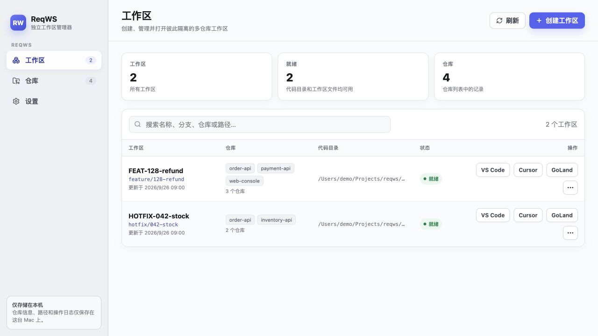
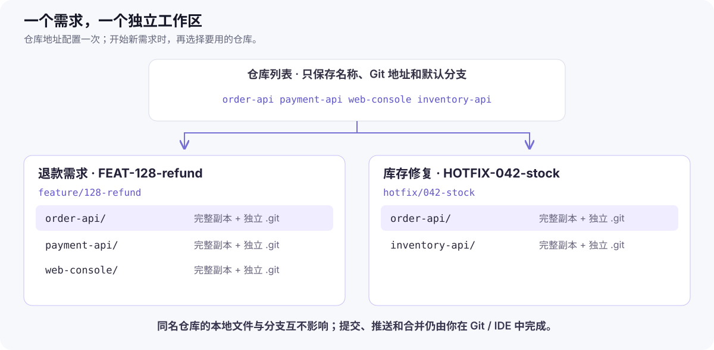

# ReqWS Desktop

**在 Mac 上，为每项需求准备一套独立的多仓库开发目录，并从一个地方打开它们。**

比如你正在做“退款功能”，需要同时修改订单服务、支付服务和前端；此时又来了一个库存问题。ReqWS 可以为两项任务分别克隆所需仓库、切换到各自的功能分支，并生成编辑器入口。你可以保留退款工作区中的未完成修改，直接打开库存修复工作区。

[下载 Desktop](https://github.com/fredgnr/reqws-desktop/releases/latest) · [第一次使用：图解教程](docs/guides/user-guide.md) · [安装与更新](docs/guides/installation.md) · [GoLand 插件](docs/guides/goland-plugin-guide.md)



*界面使用虚构示例数据。每一行是一项需求的工作区；点击右侧编辑器按钮即可打开，点击 `…` 查看详情。截图来源与版本范围见[图片说明](docs/guides/images/README.md)。*

## 什么时候适合用 ReqWS

| 你的情况 | ReqWS 帮你完成的事情 |
|---|---|
| 一项需求跨多个 Git 仓库 | 选择一次仓库集合，依次 clone，并统一切换到同名功能分支。 |
| 几项需求并行，想保留各自的本地修改 | 每项需求使用不同目录，各仓库都有完整副本和独立 `.git`。 |
| 每次开工都要寻找目录、组装编辑器工作区 | 在列表中找到需求，直接打开 VS Code、Cursor 或 GoLand。 |
| 需求包含很多仓库，GoLand 暂时只需要其中几个 | 保留全部代码，只选择本次要加载进 GoLand 的仓库。 |

ReqWS 管理的是**本机代码工作区**。它不会代你提交、push、合并分支或创建 PR，也不会同步数据库、端口、依赖缓存等运行环境。完整 clone 会占用更多磁盘和下载时间；已有的普通本地目录目前不能直接导入。

## “仓库”与“工作区”有什么区别

**仓库列表**是可复用的地址簿：记录仓库名称、Git 地址和默认分支，保存时不会下载代码。**工作区**是一项需求的实际目录：创建时才克隆选中的仓库、准备分支和编辑器文件。



图中两个 `order-api` 是不同目录中的独立副本。修改退款工作区的文件，不会改动库存工作区的文件；两者仍可连接同一个远端仓库。

## 第一次使用

1. **安装并启动。** macOS Apple silicon 用户从 [Releases](https://github.com/fredgnr/reqws-desktop/releases/latest) 下载 `ReqWS-<版本>-macos-arm64.zip`，解压后将 `ReqWS.app` 放入 Applications 目录。当前发布使用个人自签名、未经 Apple 公证；首次打开和可选证书配置见[安装指南](docs/guides/installation.md)。只运行安装包不需要 Node.js 或 JDK。
2. **添加仓库。** 打开“仓库 → 添加仓库”，填入自己可访问的 HTTPS/SSH 地址，确认名称和默认分支。建议先“测试连接”。
3. **创建工作区。** 打开“工作区 → 创建工作区”，填写需求名、功能分支、代码目录和 `.code-workspace` 存放目录，再勾选所需仓库。
4. **打开并开发。** 创建完成、状态为“就绪”后，点击 VS Code 或 Cursor。使用 GoLand 时还需[单独安装插件并选择加载集合](docs/guides/goland-plugin-guide.md)。提交、推送和 PR 继续在你熟悉的 Git/IDE 工具中完成。

每一步的截图、字段示例和完成标志见[图解教程](docs/guides/user-guide.md#第一次创建工作区)。

## 使用前需要什么

- **macOS 与 Git。** 发布版 Desktop 为 Apple silicon（arm64）；Windows/Linux 不在当前分发范围。Git 的认证需要预先配置好，ReqWS 不保存密码、Token 或私钥。
- **一个编辑器即可。** VS Code、Cursor、GoLand 都是可选项；GoLand 插件独立分发，兼容范围见[插件指南](docs/guides/goland-plugin-guide.md#安装插件)。
- **足够的磁盘空间。** 每个新工作区都会生成所选仓库的完整副本。移除记录后，磁盘文件仍然保留。

## 日常管理与数据保护

在工作区详情中可以增加仓库、逻辑移除仓库、重建 `.code-workspace` 或移除工作区记录。**这些“移除”操作不会自动删除代码目录。** 工作区成员增删与 GoLand 加载选择是两件事，详见[日常维护](docs/guides/user-guide.md#日常维护与收尾)。

ReqWS 会维护 `.reqws/workspace.json` 和 `.code-workspace`。不要把手工编辑这些管理文件作为日常配置方式；数据位置、备份方法和失败恢复见[数据与排障](docs/guides/user-guide.md#数据位置备份与恢复)。

## 从源码运行

只想使用应用，可跳过本节。开发运行需要 macOS、Git、Node.js 24 和 npm：

```bash
git clone https://github.com/fredgnr/reqws-desktop.git
cd reqws-desktop
nvm use
npm ci
npm start
```

`nvm use` 适用于已安装 nvm 的环境；也可自行准备 Node.js 24。开发实例默认会使用真实 ReqWS 用户数据，调试前请阅读[开发指南](docs/guides/development-guide.md)。源码安装命令、构建差异和独立安装目录见[安装指南](docs/guides/installation.md#从源码安装)。插件源码构建需要 JDK 25。

## 继续阅读

| 文档 | 解决的问题 |
|---|---|
| [图解使用教程](docs/guides/user-guide.md) | 跟随一个跨仓库需求，从填写配置到打开编辑器，再到维护和收尾。 |
| [安装与更新](docs/guides/installation.md) | 选对下载包、首次打开、个人签名信任、应用内更新与源码安装。 |
| [GoLand 插件指南](docs/guides/goland-plugin-guide.md) | 安装独立插件、按需加载仓库、确认同步和排查目录显示问题。 |
| [开发指南](docs/guides/development-guide.md) | 架构、运行、测试和安全边界。 |
| [完整文档索引](docs/README.md) | 查找需求、技术方案、验证记录与历史材料。 |
