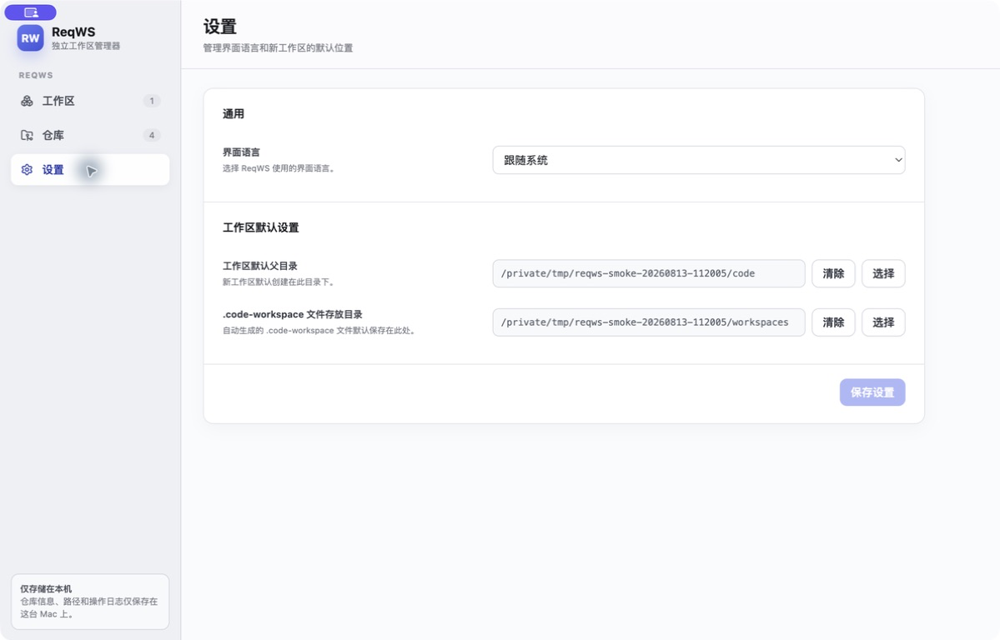
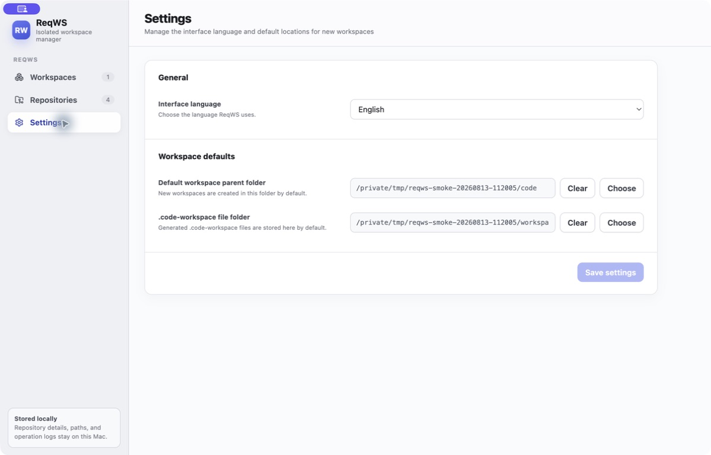

# 全局设置 packaged macOS 验证记录

本文保存 2026-08-13 对 packaged macOS 应用执行的完整自动检查、产物校验和全局设置中英文 GUI smoke 证据。

验证对象是[全局设置与界面国际化技术方案](../technical-design.md)的已实现版本。本报告是按次留存的验证快照，不作为后续代码状态的实时结论。

## 验证结论

带独立 npm 缓存的完整 package 流程成功，TypeScript、ESLint、i18n、文档治理和 Vitest 检查全部通过。生成的 arm64 `ReqWS.app` 通过 bundle 与签名校验；Computer Use 确认 packaged app 能即时切换中英文、在退出重启后保留 English 偏好，并在验证结束前恢复为 Follow system。

## 自动检查与打包

执行命令：

```bash
NPM_CONFIG_CACHE=<独立临时缓存目录> npm run package:macos
```

使用独立缓存是因为本机默认 npm cache 含 root 所有权文件；本次未修改该目录权限，也未使用 `sudo`。首次沙箱内重试又因网络解析失败而中止，随后在获准的网络环境中用同一独立缓存命令成功完成流程。

| 检查 | 结果 |
|---|---|
| `npm ci` | 通过；安装 698 个包，依赖审计为 0 vulnerabilities。 |
| TypeScript | 通过。 |
| ESLint | 通过。 |
| `npm run i18n:check` | 通过；262 个翻译 key 一致。 |
| `npm run docs:check` | 通过；8 个索引、21 个文件一致。 |
| Vitest | 通过；23 个测试文件、194 项测试全部通过。 |
| `npm run package:macos` | 通过；完成 clean install、全量检查和 Electron Forge package。 |

## 产物校验

| 项目 | 结果 |
|---|---|
| 应用路径 | `out/ReqWS-darwin-arm64/ReqWS.app` |
| 主可执行文件 | Mach-O 64-bit executable arm64 |
| Bundle ID | `com.reqws.desktop` |
| 版本 | `0.1.0` |
| `codesign --verify --deep --strict` | 通过。 |
| `codesign` designated requirement | 通过；产物满足自身 designated requirement。 |
| `spctl --assess --type execute` | 未形成通过证据；对 ad hoc bundle 返回 code signing subsystem internal error。 |
| 签名身份 | ad hoc；`TeamIdentifier` 未设置。 |

ad hoc 签名和本次 GUI 启动只证明当前本机构建产物满足 package 与本机运行 smoke，不代表 Developer ID 分发签名、公证、Gatekeeper 接受或公开发布能力。

## Packaged app GUI smoke

Computer Use 操作的是从 `out/ReqWS-darwin-arm64/ReqWS.app` 启动的 packaged app，不是 `npm start` 开发实例或 `/Applications` 中的安装副本。

| 场景 | 结果 |
|---|---|
| 中文设置页 | 通过；Settings 一级页面以中文完整显示，语言偏好为“跟随系统”，两个默认目录正常呈现。 |
| 保存后即时切换 | 通过；选择 English 并保存后，当前设置页与导航立即切换为英文。 |
| 退出重启持久化 | 通过；退出 packaged app 后重新启动，设置页仍为 English，持久化偏好生效。 |
| 恢复系统语言 | 通过；验证结束前重新选择 Follow system 并保存，未把 English 偏好留作最终状态。 |

## 截图证据

中文设置页，语言偏好为“跟随系统”：



退出并重新启动 packaged app 后的英文设置页：



两张截图均来自本次 packaged app GUI smoke；英文截图在退出重启后采集，用于证明 English 偏好已持久化。
