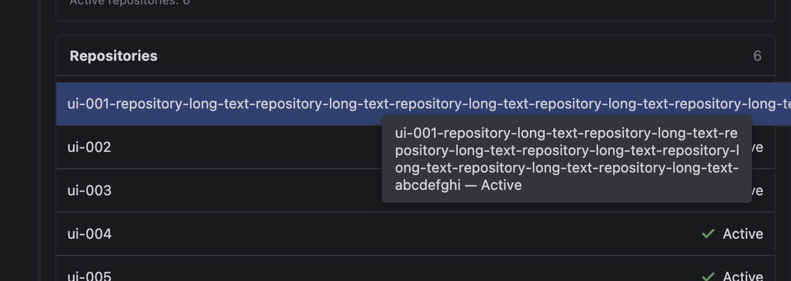
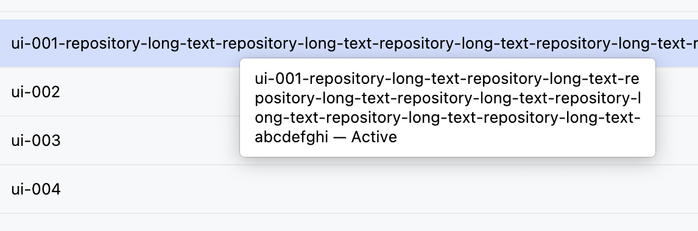

# GoLand 修复交付与验证报告

本文记录本次 squash 的最终修复范围、源码与产物绑定、验收矩阵及交付边界。

## 1. 交付结论

修复代码、回归测试和交付文档已整理为同一提交；按本次约定验收范围，结论为 **GO**。长提示三字段与两主题、启动等待与超时恢复、50+20 规模和内存观察、实际 VoiceOver、安全、Desktop 入口、仓库增删恢复、PFI/registry 失败恢复、插件启停及三仓原生 Go/Git 操作均已完成。没有已确认而尚未修复的 ReqWS 验收阻塞。用户明确跳过的 sleep/wake 保留 USER_SKIPPED，不记为 PASS；具体证据和适用边界见第 5、6 节。

本次合并 `26fb3c6517b1fcb46b2e82ed9336e24b1d2a8945`、`ce8245a9ad40564fc7716ed1388f44e9545f527d`、`6c78f80c4d28c11c3d002ec512dae0103dc2559e`，以及紧随其后的同类 UI 修复 `d34d40b65c8ce0218ecee2d180a3894841b9ec2c` 和本地未提交变更。父提交为 `768090d`；不改动更早的功能历史。本次不推送远端、不发布插件，旧远端候选可取得性记录不代表新提交已经推送。

为避免文档引用自身 commit 造成循环，最终提交通过本报告所在的 Git 提交定位；插件输入另外由下述稳定校验清单绑定。重新 squash 不改变文件内容时无需改写源码指纹，任何源码或构建输入变化都必须重建证据。

## 2. 修复内容

| 范围 | 原问题与最终行为 | 回归依据 |
|---|---|---|
| GUI-REG-01：外部 manifest 变更 | `.reqws` 排除后原子替换未可靠进入 VFS；增加非递归 native watch 与每秒固定文件/父目录 refresh，再经 350 ms 防抖同步。 | 真实外部原子替换的 watcher 测试；Desktop add/remove/re-add 真机链。 |
| GUI-REG-02/03：项目内容与 Go package | 删除 exclude 后 live ProjectFileIndex 或 Go Modules registry 仍旧；显式移除 owned entity，并顺序验证 authoritative model、PFI 与公开 registry。trusted 时每轮最多一次普通 roots event，registry 有界只读等待。 | 平台模型、registry 与外部事件回归；原 PACKAGE 移除失效、重加恢复。 |
| GUI-REG-04：状态真实与有界重放 | live 层未完成时不推进 clean digest，不显示 Synced/Active；旧 EDT publication 不覆盖新状态。外部变化的 follow-up 归属随 read/candidate 保留，避免丢失或循环。 | service、coordinator、dispatcher、view model 测试；PFI/registry 真实失败与恢复。 |
| GUI-STARTUP-01、STARTUP-DEADLINE-02、STARTUP-TIMER-03 | 首开未生成 `.idea` 不误报 ownership conflict；仅 startup lineage 可进入每秒探测、共享十分钟截止的等待。旧 read/completion 不取消或覆盖新恢复任务；unsafe entry 立即拒绝。 | startup、deadline、交错与文件状态回归；真实十分钟超时、文件/链接负例和同服务恢复。 |
| SYNC-OBSERVER-04 | Applying observer 的 PCE/CE 终止 worker，不能误当作可恢复 applier 取消；真实异常实例、终态与后续恢复边界保持。 | coordinator 与 service 的取消、重试上限、dispose 回归。 |
| UI-DIAGNOSTICS-05 | 复制成功反馈与稳定详情独立两行，重复复制不累积，新状态清理反馈，保留错误 tooltip 和辅助功能说明。 | 面板测试及真实 registry 失败复制/恢复。 |
| DESKTOP-SELECTION-06 | 详情抽屉的可选仓库变化后，可见选择、Add 禁用状态和提交 ID 使用同一有效值；不再显示 B 却提交旧 C。 | renderer 回归及同抽屉满仓、移除 B、直接重加 B 真机操作。 |
| TRACE-CANCELLATION-07 | 默认关闭的数字/枚举同步追踪不引入额外协程作用域；使用原 worker 的 ThreadContextElement 保持异常实例、自取消和 observer 语义，sink 失败隔离。 | 最初定向测试检出 3 个失败，修复后相关回归纳入完整 407 项检查；关闭时 clock/formatter/sink 零调用。 |
| UI-TOOLTIP-TRUNCATION | 长名称按当前字体度量及 Unicode 字符簇边界换行；继续 HTML 转义并保留首尾、连续普通空格。 | 修复前真实 Swing 布局检出超宽和空格丢失两个失败，修复后 21 项面板测试通过；仓库提示由用户深浅两张截图确认；工作区、分支在两主题下由用户逐项确认完整，见第 9 节。 |
| 开发与安全回归 | 补齐非法 GoLand bundle candidate 的 zero-spawn 用例；纳入共享 `.vscode` 任务、ESLint 与项目 TypeScript 配置，忽略仓库根目录 IDE 自动生成的 `.idea/`。 | Desktop 完整检查；共享配置不含个人绝对路径，本机 IDE 文件保留在磁盘。 |

上述修复保持 Desktop 唯一 manifest writer、插件零 VCS mutation、用户模块保护和 `go.work` 不写入边界。GoLand 响应 roots event 产生的原生命令、下载、配置保存与插件调用分开归因。

## 3. 最终源码、环境与自动化

本次整理在 2026-09-13 重新运行检查，代码文件与整理前逐字节一致。环境：macOS 15.7.3 / 24G419，arm64；Node 24.20.0、npm 11.19.0、OpenJDK 21.0.12.1。构建基线为 Gradle 9.3.0、Kotlin 2.3.20、IntelliJ Platform Gradle Plugin 2.18.1，插件版本 0.1.0。GUI 使用官方 GoLand 2026.1.3 / GO-261.25134.147、JBR 25.0.3、Go 1.26.8 与 bundled Delve 1.26.0；个别故障场景先自动选择 Go 1.27，后改回固定 SDK，不能把此前阶段写成固定 1.26.8。

| 检查 | 结果 |
|---|---|
| `npm run check` | 32 个文件、339 项测试通过；TypeScript、ESLint、270-key i18n 与文档检查通过。 |
| 插件完整检查与 `buildPlugin` | 37 suites、407 tests，0 failures/errors/skipped；20 个任务实际执行。 |
| 禁止生产符号检查 | 46 个生产文件、333 个 composed JAR class 通过。 |
| Plugin Verifier | GO-261.25134.147、GO-262.8665.270 均 Compatible；项目配置与结构检查通过。 |
| `npm run package:macos -- --skip-ci --skip-check` | 使用刚通过检查的现有依赖构建 arm64 应用，bundle 校验通过；没有安装到系统。 |
| 文档整理后检查 | 重新运行 `npm run docs:check` 与 diff 校验，确认索引、链接、元数据和空白一致。 |

可复现命令（`JAVA_HOME` 指向 JDK 21）：

```bash
npm run check
npm run check:goland -- --offline --no-daemon --rerun-tasks --no-build-cache --no-configuration-cache buildPlugin
npm run package:macos -- --skip-ci --skip-check
npm run docs:check
git diff --check
```

离线命令使用已下载的固定依赖和 verifier IDE；首次构建需先取得依赖。原生日志仍包含 SDK layout/classpath、CDS 等 warning，Compatible 不等于运行全程没有平台警告。

| 最终绑定 | SHA-256 / 大小 |
|---|---|
| [99 项插件输入清单](plugin-inputs.sha256) | `e2c1fbc508963cc07771c02bc60ae3f566f04fc84828b7f02972e30b3f1702b6` |
| `reqws-goland-0.1.0.zip` | `f338d18bd10e094be1a854adef84116c6fda0de9ee0577c16cbd006313f1a9b3` / 647802 bytes |
| ZIP 内 `reqws-goland-0.1.0.jar` | `e13fd89589b9315874ac039daf75eb2ac022510ab8b2470fad534325e9b000cb` / 694365 bytes |
| Desktop `app.asar` | `c73a651f539e5c7816fac0cb3ddafabe800b4fc4e8eed9f715cf188cbf744d10` |

插件清单覆盖五个顶层 Gradle/wrapper 入口、`gradle/wrapper/` 和全部 `src/`，以插件根目录相对路径按字符串排序；每行是 `SHA256 + 两空格 + 相对路径 + LF`，对完整 UTF-8 清单再求 SHA256。本次重建的 ZIP/JAR 与 10:09 提示修复候选字节一致，99 项输入也逐项相同。

## 4. 最终候选与证据归属

最终插件由第 3 节的 e2c1fbc5 输入清单、f338d18b ZIP 和 e13fd895 JAR 绑定。第 9～19 节记录该候选的实际 GUI、采样和用户反馈；Desktop 使用相同最终 ASAR c73a651f。正式会话均已正常退出并审计，准备阶段主动结束的旧会话及旧日志前缀单独排除。

早期探索和被替代候选的逐日过程不再重复作为交付结果，其原始记录留在第 7 节证据目录。保留的修复前失败用于解释回归覆盖，不能代替最终候选通过；用户确认、工具实际界面、平台测试与采样观察分别标明。

## 5. 最终验收矩阵

| 条件 | 最终结果与证据 |
|---|---|
| GL-01 未安装 | Desktop 探测、不可用呈现与其他入口回归通过，见第 3 节完整 Desktop 检查。 |
| GL-02 标准安装 | 实际列表/详情入口打开正确 root，冷启动与运行中复用均完成；启动参数与进程归因见第 15 节。 |
| GL-03 Toolbox 安装 | 真实安装的 262 探测、磁盘插件安装与打开验证通过，见第 15 节。 |
| GL-04 首开 | 最终候选真实 metadata 等待、平台保存后自动投影、原 PACKAGE 与搜索通过；取消恢复由当前平台测试覆盖，见第 14、16 节。 |
| GL-05 新增 | 实际 Desktop 添加 C 后四层投影、原 C PACKAGE 校验/执行与搜索通过，见第 15 节。 |
| GL-06 移除 | B 磁盘保留，退出内容/默认搜索/registry，旧 PACKAGE 失效，映射保留供手动决定，见第 15、18 节。 |
| GL-07 重加 | 同目录及原 PACKAGE 自动恢复，不重建配置；缺映射正确提示，用户配置后自动 Synced，见第 15、18 节。 |
| GL-08 原子替换与并发 | 两组负载、100 次写入、同 JVM 60 次变更及当前交错/取消/防抖平台回归通过，见第 11、12、14 节。 |
| GL-09 错误与缺失恢复 | 非法 manifest 保留模型、稳定诊断与恢复，真实 missing gap 后独立 PACKAGE/搜索通过，见第 13、15 节。 |
| GL-10 路径安全 | 双端解析与路径/identity 回归、真实非法输入及外部链接拒绝通过；原生 VFS 写入独立归因，见第 3、10、13、16 节。 |
| GL-11 Safe Mode | 最终候选只读、零受管 apply/roots 通知；遵循原生信任后关闭重开步骤恢复四层，见第 15 节。 |
| GL-12 重启 | Desktop 不运行时真实重开，原 PACKAGE 与搜索恢复，见第 15、19 节。 |
| GL-13 用户配置 | 用户 module/content root/依赖及顺序保持；VCS 只读，手动映射事件、metadata 冲突和旧文件 inert 验证通过，非空 rootSettings 有实际平台证据，见第 14、16～19 节。 |
| GL-14 50+20 | 同步、负载、Git/搜索/PACKAGE 与启动/内存补测完成，未建立持续事件风暴、卡顿或泄漏证据，见第 11、12、15 节。 |
| GL-15 全面回归 | 339 项 Desktop、407 项插件、两版 Verifier 和 arm64 package 通过；源码/产物保持绑定，见第 3 节。 |
| GL-16 视觉与可用性 | 最终布局、状态文字、长提示三字段×两主题、窄宽度、键盘和 VoiceOver 通过，原生差异有记录，见第 9、13 节与界面索引。 |

原生 Go 能力补充：A/B/C 补全、声明跳转、引用查找、PACKAGE、MAIN Run/Debug 与 Git Log/diff/Commit 根归属已完成，人工与独立证据边界见第 19 节。

## 6. GO 结论与保留边界

原 NO-GO 的剩余验证项已关闭。结论适用于本报告所在的最终本地提交和第 3 节精确 ZIP 哈希；没有以未观察到异常代替缺失的关键功能结果。最终提交 SHA 在 Git 和交付回执中给出，避免文档自引用哈希循环。

- sleep/wake 按用户明确要求为 USER_SKIPPED。生产构建没有受控 cancellation GUI 注入入口，该条件式 GUI 项不适用；取消/重试仍有第 14 节当前实际平台测试。
- Safe Mode 原地信任后需按 GoLand 原生要求关闭并重开，261/262 均已验证，步骤已进入指南。
- 外部 `.gitignore` 写入归因于原生 VFS；“整个 IDE 外部零写入”不成立。插件不干预平台自身写入，仍保持其自身的文件和 VCS 边界。
- 有限资源和 JFR 采样不构成无限期性能保证，也不代表整个 IDE 零进程/网络。GoLand 原生 daemon、linter、反馈弹窗和保存行为按各阶段记录，不归为已修复的 ReqWS 问题。

全部正式补充会话已完成退出与采集审计；测试过程中的受控修改、恢复和旧日志前缀有独立记录。没有远端推送、插件发布或数据迁移。

## 7. 保留证据与复核方法

真机原始记录来自本机工作目录 `work/reqws-verification-20260912`，按 `environment/runs/<run-id>` 与 `environment/preflight/` 保存；完整位置可由本次上下文任务定位。原生日志、系统路径与大量过程快照不进入产品仓库。以下哈希用于回查原件，不保证离开该机器后仍能取得全部原始材料；截图、输入清单与本报告随代码保留，重要原始数据另行备份后再清理。

| 终态或阶段审计（相对 preflight） | JSON SHA-256 |
|---|---|
| `readiness-timeout/formal-r01-timeout-observation.json` | `08cffe44aafb6a061b389194fdce260aedf3d35d13f718b49a289b87d60998be` |
| `config-protection/r02-recovery-terminal-audit.json` | `22f4a8426b25b9097f2ceb89aa6b21be7ee97591ef4b58df377c711c03b81f00` |
| `config-protection/r03-recovery-terminal-audit.json` | `79da93860235fcb88d9cea4aa4fd22d0433b7a897f13fe47e705ffaa8817ac96` |
| `config-protection/r06-recovery-terminal-audit.json` | `19060468121f6ba1e1a113ca5f3d91bfdfc4ebbd52dc34f5eaa51800b8d91f1c` |
| `config-protection/c03-recovery-terminal-audit.json` | `6d58515ee40a88a2c09510e750da085f1369ab41c717ea1c728f58b39c45b26c` |
| `ui-acceptance/ui-terminal-audit.json` | `f7e0f969ce7e0017f3bc4f69fa689711bb294255a935a8205b1145c698776264` |
| `ui-tooltip-retest/initial-runtime-core.json` | `e1e9f55d6ea013550f6847a6085e805c0d99e73582772b537a4262a1b6763ba3` |

原审计按日志 identity/byte ranges 处理续接、缺口与轮转，采样不能证明所有短命进程或瞬态写入被捕获。部分 trace 序号因并发写出顺序交换，集合完整不等于原行序严格递增。早于 9 月 12 日的一部分临时原件已缺失；不依赖那些不可复核旧材料扩大本报告结果。

| 随提交保留的截图 | 候选 / 原始 run | SHA-256 |
|---|---|---|
| [六仓深色同步态](../ui/tool-window-synchronized-dark.jpg) | e2c1fbc5 / 9f8ce321 | `b63da1548063fee135cf87ab73d99c0994bd799e8d5680e8b1c52f1bd6715abb` |
| [浅色布局](../ui/tool-window-synchronized-light.jpg) | ae64a9ca / 9d100fa0 | `cc21c9db0d7cfb9b77c12a527661a06679b370ce6a2d0d8b5fc3518fdb698d22` |
| [registry 失败与复制反馈](../ui/tool-window-registry-failure.jpg) | ae64a9ca / 362e580a | `87893c2eeccc48b8c0576691f95da034bf25c509bff2961d2178a0daf76760cc` |
| [Desktop 重新添加 B](../ui/desktop-repository-readded.jpg) | c73a651f / 5f7a40cd | `a91cfc7cf49ef31ad61df60845dd56e85f4087bc34159f479912785eb480b46f` |

以上截图均逐图复核为隔离 fixture，没有用户账号、凭据或真实远端；复制原始字节，没有编辑截图来补造结果。静态截图不单独证明自动触发、零文件写入、完整生命周期或悬浮提示通过。

## 8. 文档交付与使用

保留需求、技术方案、测试方案、界面设计、必要截图与常青指南；删除探索实施计划、逐日中间报告、重复 open-bugs 清单和被替代的截图。当前报告统一承载修复与交付状态，不另建内容相同的 delivery 文档。未发生安装迁移、协议升级或公开发布；没有修改冻结参考材料。

安装、更新、停用与排障见[插件使用指南](../../../guides/goland-plugin-guide.md)，开发与追踪步骤见[开发指南](../../../guides/development-guide.md)。如需停止使用，从 GoLand 原生 Plugins 页面停用；不通过清空 `.idea`、删除受管状态或回滚用户目录来消除诊断。恢复旧本地插件前应先备份工作区并核对旧版本安全边界，本次不承诺跨开发候选状态降级迁移。

## 9. 补充真机验证：长名称悬浮提示

本次在提交 `0ef2eab` 对应的 e2c1fbc5 / JAR e13fd895 候选上重新启动隔离 GoLand；run 为 `8cd9513a-c1f1-4801-8f9f-47067d240369`，PID 84530，项目 ui-acceptance，六仓 Synced。99 项源码输入和已安装 JAR 在启动前核对一致；官方应用签名在正常系统读取环境中通过。早先受限环境的签名校验失败不表示应用资源损坏，额外预备会话已正常退出。

用户最初反馈“没有换行，末尾被截断了”，随后明确更正为“实际没有被截断，完整展示”，并提供真实截图确认具体范围为仓库行悬浮提示。截图显示四行完整文字，尾部 `abcdefghi — Active` 可见；面板仓库行本身因宽度省略文字，不等于悬浮提示被截断。本次据此关闭**深色主题下仓库长名称提示完整性**，撤回先前对该场景的失败判断，没有修改生产代码。该图不同时证明工作区、分支或浅色主题。



用户原图逐字节保存，SHA-256 `edc25a68acffe5d1f6f57260034f789504e492ceb451e10077a156f2b7a15d6a`。图中仅有隔离仓库名与状态，无用户账号、凭据或真实远端；未做裁切或内容修改。截图来源为用户当场提供，本轮工具截图未捕获悬浮窗，两者取证方式分别保留。

### 两主题复测终态

用户随后在浅色主题、日常窄面板宽度下确认工作区、分支和第一行仓库提示均“完整”，并提供下图；恢复 Islands Dark 后又确认工作区、分支“显示完整”。因此三字段 × 两主题的长提示完整性通过；两个仓库提示有截图，另外四项来自用户现场观察，未混称为六张截图证据。日常窄宽度有用户确认，未测量精确最小逻辑像素宽度；VoiceOver 未执行。



浅色原图逐字节保存，SHA-256 `881b3f47fd91ade8a2e6ed47743fc1b81bf5bd2577c802cd6815173c85bfed78`；完整尾部 `abcdefghi — Active` 可见。该 run 于 11:50:00 +08 正常退出（exit 0）；584 次采样，最大间隔 1.340 秒，采集器无错误/日志缺口，声明的输出哈希全部复核。源文件、manifest 与 `.run` 保持；既有文件仅 IDE ownership、workspace.xml、misc.xml 保存变化，不宣称整个 `.idea` 不变。原件与反馈保存在本次任务 `work/goland-verification-20260913/environment/runs/8cd9513a-c1f1-4801-8f9f-47067d240369`。

## 10. 补充真机验证：外部 `.gitignore` 写入归因

使用相同官方 GoLand 与最终插件，建立两组独立 profile/workspace，将测试 `.idea` 链接到各自外部哨兵目录。启用组 run `8cde9d35-3649-427c-b24f-bf8166f5eeec`；停用组 `62cc7024-1825-458c-90c8-1e1b1ecebec2` 的原生日志明确列出 ReqWS Disabled，且无 ReqWS trace。启用组最初因 fixture 时间戳格式不合法而拒绝，保留原件并修正后真实状态为 OWNERSHIP_CONFLICT；停用组在启动前已通过真实 shared schema 校验。未将首次解析失败混作 ownership 拒绝。

JFR FileWrite 在启用组 11:51:05.307、停用组 11:54:44.302（+08）分别记录经 symlink 路径写 `.idea/.gitignore`，均为 228 bytes，内容 SHA-256 均与旧 R03 的 `de3dcd3b…f6d700` 相同。两组实测栈相同：`SafeFileOutputStream.writeData → close → FilterOutputStream.close → LocalFileSystemBase$1.close → PersistentFSImpl$3.writeToDisk`。JFR 设施先用已知 FileWrite 自检通过；此处记录的是异步 VFS writer 栈，并非完整上游生成器栈。

结论：本次复现由 GoLand 原生 VFS 保存产生，停用 ReqWS 仍发生，不依赖插件启用。没有证据支持为此修改插件以阻止 IDE 自身保存；旧 R03 本身没有 writer 栈，仍保留原证据边界。两组 external sentinel 未变，但目标目录还产生原生 IML/VCS/modules metadata，所以“整个 IDE 对外部目录零写入”仍不成立；S-17 不记整项 PASS。

两组均正常退出 exit 0，采集器完整且声明输出哈希通过。证据在本次任务 `work/goland-verification-20260913/environment/attribution-result.json` 与对应 runs；最终 JFR SHA-256：启用 `fae0037f1d2ba30f66c6d3736c286dfce2feaafd894d243fcea3f22f49043759`，停用 `bc39e01dde3fbd00229c56d672a56e67c74c8179de128e9f10a9b7a8c345c322`。运行日志和机器路径不复制进产品仓库。

## 11. 补充真机验证：50+20 规模与性能

两次使用第 3 节完全相同的最终输入/ZIP/JAR，官方 GoLand 261、固定 Go 1.26.8；50 个活动仓库加 20 个保留仓库，每仓最小独立 Go module、无外部依赖。测试脚本只在隔离 fixture 原子替换 manifest，不调用 VFS refresh；源文件和预先准备的五个 PACKAGE 配置始终保持。这里的增删是规模负载脚本，不能替代第 5 节真实 Desktop 点击链。

| 运行 | 追踪 | 结果 |
|---|---|---|
| `294630ee-e691-4882-ada4-a948423647db` / PID 90257 / service `2280525758713459` | 开 | 初始及负载后 Synced 50；正常退出 exit 0，1113 次采样，最大间隔 1.620 秒。 |
| `643cf5d7-1a50-4dff-96d0-3510fcfa629f` / PID 97532 | 关 | 新 JVM 读取同摘要并自动 reconcile；再执行同样负载后 Synced 50，正常退出 exit 0，486 次采样，最大间隔 1.286 秒。计数无法由“无 trace”倒推。 |

开启追踪的十轮 add/remove 共 20 次变化（50↔51），每次实际 MODEL/PFI/REGISTRY 成功、accepted=1、owned 排除集合与目标一致；从原子写入开始到采样观察完整 projection 为 1.420～3.257 秒，中位数 2.175 秒（含 200 ms 观察分辨率，不是规定时限）。GUI 在初始/最终另行核对，不声称每个中间切换都执行了 PACKAGE。关闭组的 20 次变化逐次以 owned 排除集合和原生 registry converged 日志观察，未借用开启组的 span；100 次写入后面板摘要 `0140fb2feea3` 与最后一次写入一致。

开启追踪时，100 次快速写入在 1.445 秒内完成，原生日志为 4 个 VFS batch、3 次 watcher dispatch、5 次 submit、4 次 apply（2 AUTOMATIC、2 PROJECT_MODEL_CHANGE）及 1 次 no-op；4 次均 APPLIED/accepted=1。最终 manifest 与最后一次写入哈希一致，面板 `128402390d22` 与该哈希前缀一致。随后 10 次同字节原子替换合并为 1 次 clean no-op，0 apply；独立 Sync Now 的 request 52 对同摘要重新 apply，92.983 ms、registry 1 read/0 wait/0 notification。重开使用新 service，不能套用旧 coordinator 的 no-op。

完整 trace 共 3393 条，单 service 的 seq 集合连续且无重复；原生 inode/byte ranges 从 0 连续重组并校验哈希，不重复计算 collector 前缀。48 次 apply 全部 APPLIED；70 次 roots callback 中 46 次 GUARDED、24 次 QUEUED，实际防抖 dispatch 为 1 FOLLOW_UP + 23 PROJECT_MODEL_CHANGE。后续空闲证明其停止，不能将所有异步平台 event 都归为 ReqWS guarded self-event。每次 registry notification 为 0 或 1，最多 54 reads/52 waits；含首开最长 5.484 秒，未超时。1164 次 refresh 全部记录 FIXED_MANIFEST_AND_PARENT，未出现递归范围。

| Adapter 阶段 | 实际 span 数 | 中位数 / 最大值（ms） |
|---|---:|---:|
| authoritative model | 48 | 122.190 / 908.739 |
| PFI | 48 | 39.438 / 739.000 |
| registry | 48 | 20.585 / 5485.193 |
| VCS 只读诊断 | 53 | 5.338 / 25.784 |

开启追踪的两个 60 秒空闲区间分别是 11:59:37～12:00:37 与 12:11:00～12:12:00（+08）；实际 refresh 57/59 次，READ/WATCH_DISPATCH/APPLY/roots dispatch 均 0，没有新 indexing。后一段包含一次 JFR dump，因此资源数值包含诊断开销，不称为完全无干预基准。关闭追踪的基线为 12:18:51～12:19:51，负载后为 12:23:55～12:24:55（+08）；CPU/线程/堆/RSS 由独立 JFR 与进程采样汇总如下；无 trace 仅证明开关关闭，精确 idle callback/apply 数不适用。

| 60 秒区间 | JVM CPU 平均 / 最大（占整机容量） | 活跃平台线程 | GC 后堆（MiB） | RSS（MiB） |
|---|---:|---:|---:|---:|
| 开 / baseline-idle | 1.02% / 13.68% | 79～94 | 203.1～203.1 | 727～1051 |
| 开 / post-pressure-idle | 0.51% / 3.88% | 73～74 | 215.7～215.7 | 870～930 |
| 关 / baseline-idle | 1.28% / 16.59% | 68～77 | 392.9～406.9 | 1029～2006 |
| 关 / post-pressure-idle | 0.36% / 1.38% | 66～72 | 该区间无 GC 样本 | 1828～1877 |

线程数在负载后回落，未观察到随每轮同步持续累加的线程。关闭组最终空闲 RSS 约 1.8 GiB，高于基线均值，且此区间没有 GC 后堆样本；开启组 GC 后堆从约 203 MiB 到 216 MiB。有限采样未建立长期泄漏证据，也不足以证明内存已回到初始水平。JFR CPU 按整机容量归一，不能直接当成 Activity Monitor 的单核百分比。两组 profile/system cache 独立，第二组复用 Go 编译缓存，未控制所有缓存/系统负载因素，所以不据均值差异声称追踪开关的精确性能开销。

开启组首次冷索引 26.450 秒，原生报告 1/26 very slow（general 与 EDT）；后续索引 1 ms、45 ms 均 responsiveness ok，未发现持续 indexing 或 freeze dump。关闭组首次索引 13.825 秒、后续 1 ms 和 47 ms 均为 responsiveness ok。前述慢采样仍保留，尚无精确阻塞归因；不宣称启动全程无卡顿。

规模后真实 In Project 搜索 `REQWS SCALE` 返回截断计数 100+，不将它记为精确 100；`repo-05` 前缀只有 repo-050 的两处结果，`repo-06` 与 `repo-070` 均无结果，覆盖全部保留范围。图像与 AX 存在延迟，正则尝试及错时图片不作为独立通过依据。两组各执行原 repo-001 PACKAGE，均实际 1 test passed / exit 0，运行参数是 package import path，配置 `<kind value="PACKAGE"/>`，不是 FILE/DIRECTORY。界面动作一度未从工具生效，用户当场确认 ⌘⇧F 能打开，随后工具完成搜索和测试；线程快照的 EDT 当时等待事件，未复现卡死。Git Log 工具操作只取得 Paths 菜单，未把此记录写成 Git Log 交互 PASS。

开启组 GoLand 原生 GoExecutor 共 1161 条 go list 完成记录，均 result 0；按 task、working directory 与完整 commandline 对起止逐项配对，1161 对无缺失，时长中位数 24 ms、最大 395 ms（0 ms 为日志分辨率）。它们由平台 GoExecutor 执行，不能记为插件直接 spawn；不是 1161 个采样到的唯一进程。源码/bytecode 的零直接 Go spawn 门禁仍适用。关闭组另外记录 1211 次原生 go list 完成，均 result 0。GoLand 原生 VgoModuleDownloader 在开/关组分别记录 1111/1211 次“Downloading dependencies”调度以及 22/24 次“No new dependencies downloaded”；两组未见 GoExecutor 的 go mod download 起止。fixture 无外部依赖且 GOPROXY/GOSUMDB 关闭，不能把这些调度文字当成已下载依赖，也不能用本次结果证明任意 payload 都不会访问网络。两组端点分别核对 286 个受保护文件，无变化、无新增 go.mod/go.sum/go.work；manifest 是测试脚本有意变化，`.idea` 原生保存另计。

原件与分析位于本次任务 `work/goland-verification-20260913/environment/scale-on-results`、`scale-off-results` 与对应 runs。两组 collector 声明输出哈希均通过、原生日志连续且无采集缺口；一秒采样不能捕获全部短命进程/瞬态写入。最终 JFR：开启 `7750784cd95f4370cb80ffc297515cc74686dd45ba0c99e9b033c468418111b3`，关闭 `0c7686784a4200ed214641ca7e7944273f43bf8d1394ae55870423611fd51b14`。分析汇总不是新建产品中间文档；本报告保留最终数据与限制。


## 12. 补充结论：启动采样与重复同步内存

使用第 3 节最终输入、官方 GoLand 261 和相同 50+20 fixture，新增四个正常退出的隔离会话。观察器是仅用于验证的 Java agent，每 250 ms 向已有 EDT 投递一个空任务，延迟超过 200 ms 时捕获等待期间的 EDT 栈。先用已知 600 ms 阻塞自检，测得 396 ms（受投递相位影响），确认能取得实际阻塞栈。初次启动参数误写为 `-javaagent=`，被平台忽略；该预备会话不作为 EDT 观察证据，修正后的会话使用 `-javaagent:`。观察器不进入交付 ZIP。

| 会话 | 条件与实际结果 |
|---|---|
| `b418c095-34ba-4f35-8d49-1e85adfeb940` | 新 system cache；冷索引 15.798 秒，平台 responsiveness OK。无有效 EDT 探针，只保留原生/JFR/NMT 记录。 |
| `ee8d4666-70f2-4301-8c40-c75c00247830` | 复用上一会话缓存、有效探针；最长 2.260 秒等待发生在 ReqWS service 创建前，栈为原生 toolbar 初始化；另有原生 Project tree classloading、EditorState/VCS console 初始化等待。随后同 JVM 执行三批各十轮 add/remove。 |
| `c21f5b38-af6d-4849-b13f-a5280c8a068b` | 新 system cache、原生日志确认 ReqWS Disabled；冷索引 14.720 秒，responsiveness OK；启动仍捕获 206～477 ms 的原生 classloading/data-context/lazy-instance 等待。 |
| `a94e44e2-1308-469c-8c76-277192d5e7c5` | 新 system cache、ReqWS 启用；冷索引 15.155 秒，responsiveness OK；965 ms 最长等待发生在 service 创建前，另有原生 EditorState/VCS console 与 ActionToolbar 初始化等待。 |

这些实际等待栈没有 ReqWS frame，且部分发生在其 service 创建之前；停用对照也存在原生启动等待。这支持把本次捕获的启动等待归入 IDE 初始化，不支持为其修改插件。原来 26.450 秒冷索引中的那一个 very slow 样本仍没有精确阻塞栈，不能用新会话给旧样本补造归因；原 JFR 中另一次 1.412 秒 shrinking GC 也不属于该冷索引区间。各 profile/cache 条件不同，不以这些耗时差值声称插件开关的精确性能开销。

同 JVM 的三批共 60 次 manifest 变化均通过 authoritative、PFI 与 registry 门禁，并核对 50/51 个活动仓库对应的 owned excludes。负载期间 EDT 样本数为 283/283/272，延迟中位数 0.170/0.129/0.140 ms，最大值 26.811/20.426/23.542 ms，未采到超过 200 ms 的等待。采样最大值不是未采样时段的绝对上界；强制 GC 和诊断命令区间单独标记，不作为自然负载停顿。

| 检查点 | 初始 | 第一批后 | 第二批后 | 第三批后 | 空闲后 |
|---|---:|---:|---:|---:|---:|
| 强制 GC 后存活堆（MiB） | 185.7 | 191.8 | 193.7 | 194.0 | 190.4 |
| NMT heap committed（KiB） | 645120 | 645120 | 645120 | 645120 | 645120 |
| NMT Other committed（KiB） | 513783 | 552962 | 552998 | 553044 | 551885 |
| NMT code committed（KiB） | 79832 | 113275 | 112168 | 114004 | 113280 |
| 核心 service/watcher/coordinator 实例数（分别） | 1 | 1 | 1 | 1 | 1 |

这组实测没有呈现随批次持续增加的存活堆或核心实例。NMT 总 committed 从约 1.62 GiB 到 1.72 GiB，包含堆、代码和原生分配；reserved 不等于已使用内存，RSS 也不能直接当作 JVM 存活对象量。第 11 节关闭组的 1.8 GiB RSS 观察保留，不以本组数据声称旧进程已经回落。

`PersistedManagedExclude` 从 21 增至 51，逐项对应同 JVM 必须保留的 30 条 recovery claim，共增加约 720 bytes；这是现行设计要求的恢复凭证，不能在同 JVM 内提前删除。状态有 256 KiB/4096 claims 上限。最后一个新 JVM 从磁盘重新验证后，managed=21、recovery=0、该类实例回到 21，证明恢复凭证按冷启动规则压缩。没有把这一有意保留的有限记录误修成删除恢复证据。

四个会话均 exit 0，采集终态完整、声明输出哈希全部通过，286 个受保护文件逐项未变。原件位于本次任务 `environment/gate-close` 与对应 runs：三批负载明细在 `memory-ee8d4666-70f2-4301-8c40-c75c00247830`，冷启动压缩结果在 `reopen-recovery-state.json`。复用 profile 的日志包含上一会话前缀，分析按当前 service `2284036886597251` 及时间过滤，未把旧前缀算入本轮事件。

## 13. 安全输入与 VoiceOver 验收

最终 JAR 的隔离会话 `79d39d33-9f8d-4998-a445-e386472126c2` 使用单仓 security-go fixture。初始 Synced，原 `repo-001 PACKAGE` 在配置编辑器中显示 Package kind、正确 import path 和可用 Run，随后实际一项测试通过、exit 0。

同一份命令样式 manifest 同时交给生产 TypeScript schema 和已安装 JAR 的 Kotlin parser，两者均按字符串接受；GUI Synced，工作区/分支中命令样式文字保持字面值。其 SHA-256 为 `f313c10c052f18e34a4fea5df8e4cb2ffbffab42148b635f0bd9db5d4d05474c`。URL 指向有正向自检的隔离回环连接哨兵；字段中的 `touch` 只是待验证数据，没有作为测试命令执行。

敏感 query 使用明确的假 token；两端 parser 均拒绝，真实面板显示 `Error / MANIFEST_SCHEMA_INVALID` 和保留上次有效模型的说明，零 apply、ownership bytes 未变。输入 SHA-256 为 `bbd603325bb1ac009396eb3870d4dab01cd8d8ba3bfb51a4bfb13849f40b1c30`。两个阶段分别观察至少 20 秒，命令哨兵文件均不存在、连接哨兵均无非自检请求、普通原生日志无 payload 标记/假 secret，`.run` 和 Go 源文件保持。

恢复前的 JFR 快照实际包含 90 个 ProcessStart、112 个 SocketWrite、327 个 SocketRead；没有 payload 标记、哨兵端口或 ReqWS 栈。这是该快照的事件审计，不是整个 JVM 零进程/零网络断言。该快照之后，用户在原 Error 场景使用 VoiceOver，确认错误状态/说明及 Sync Now、Open Manifest File、Copy Diagnostics 三个动作的语音反馈无问题。此证据来自用户实际听读，未混称为工具合成或录音。

恢复原 baseline manifest 后，约 0.823 秒观察到自动成功终态（含 200 ms 观察分辨率），再观察 20 秒；真实面板 Synced，原 repo-001 PACKAGE 再次 1 test passed / exit 0。通过原生 Quit 正常退出，进程 exit 0，采集完整：6297 次采样、最大间隔 4.130 秒，原生日志连续，全部声明输出哈希有效，service 的 13517 条 trace 连续且 dispose 完成。五个受保护源码/Go module/原配置文件保持，原 manifest 字节恢复，无新增 go.sum/go.work。

完整 JFR 实际包含 ProcessStart 177、SocketWrite 168、SocketRead 521、FileWrite 27182 个事件；Process/Socket 事件没有 payload 标记、哨兵端口或 ReqWS 栈，普通原生日志也无这些标记。连接哨兵在开始和结束各一次正向自检成功，全程只有这两次自检连接，随后正常停止。该结论针对本次明确输入与完整记录，不声称整个 JVM 零进程/网络，也不把原生 Go/Git、日志和 metadata 写入算作插件违规。结果和原件索引为 `environment/gate-close/security/terminal-audit.json`、`final-native.log`、`final-events.json` 及对应 run；S-05/S-06 通过。

## 14. 条件验收与证据适用性

测试方案第 8.5 节将首次 read/apply cancellation GUI smoke 限定为“若测试构建提供受控 fault injection”。最终生产构建没有该注入入口，因此此 GUI 子项记为不适用，不声称已在真机注入。取消恢复本身并未豁免：最终输入对应的真实平台 service/coordinator 回归覆盖首读/首 apply 的 PCE 与 coroutine cancellation、一次有界重试、更新 generation 胜出、dispose 和 owner cancellation；第 3 节 407 项结果及 `gate-close/contract-test-map.json` 中的具体用例/XML 哈希可复核。virgin metadata 等待与真实重启仍由各自 GUI 记录证明。

非空 `rootSettings` 使用真实 `ProjectLevelVcsManager` 平台测试，`testPublicPlatformMappingsAndRootSettingsRemainByteForByteUnchanged` 保留原 mapping、顺序及同一非空 settings 实例，并核对文件字节；该 suite 9 项、零失败，XML SHA-256 `d68eaa318a7ff791e117c4641e6ca09815171a1d2cc24205b6546bf4d5f6ebb4`。普通 Git UI 中的 null settings 不冒充自定义非空场景；生产零 mapping writer 门禁和既有 C01 GUI 配置保护分别保留其证据范围。


## 15. 最终候选的真实入口、仓库变更与恢复

本节使用第 3 节最终输入 **e2c1fbc5**、ZIP **f338d18b**、JAR **e13fd895** 和 packaged Desktop ASAR **c73a651f**。GoLand 为本机 Toolbox 实际安装的 2026.2.1.1（`GO-262.9437.286`、JBR 25.0.3），Go 为隔离的 1.26.8。所有操作使用独立 profile、本地生成的 Git fixture 与测试工作区，未修改日常 GoLand 配置。

### 15.1 安装与 Desktop 入口

在 packaged Desktop 的工作区列表点击 GoLand，实际启动 `/Users/fred/Applications/GoLand.app`；通过 Settings → Plugins → Install Plugin from Disk 安装本次 ZIP，核对已安装 JAR 的完整哈希。动态加载后同步成功，正常退出再从详情入口启动仍成功；再次点击详情入口复用同一 JVM 的正确工作区。生产 resolver 的默认发现通过；另以逐字节复制的真实 Toolbox state 和隔离的空标准目录，验证 Toolbox 分支找到同一真实安装。后者是目录依赖隔离测试，不代表默认入口实际选择了 Toolbox state 分支。无安装候选时返回 NOT_FOUND。

Desktop run `abd5d843-5225-4036-8889-974ac9468a4d` 正常退出码 0；GoLand 外部采集 run `b1681ca8-e33c-4ffc-b5f5-8dad6249da7d` 跨两次正常 GUI 退出，采集完整且声明哈希一致。LaunchServices 子进程退出码不可取得，记录为已观察到进程正常 GUI 退出，不填造 exit 0。测试 Git shim 曾使原生 Git version 检查失败，已在隔离 profile 指定系统 Git 后重启复核。原生 OS Integration daemon 异常发生在 ReqWS 安装前，未算作插件启动异常。

### 15.2 同一详情抽屉的四层变化

Desktop 实际创建 `delivery-flow`（初始 A/B），在第一次 GoLand 打开前保存六份原生 `.run` 配置：A/B/C 各一份 MAIN 和 PACKAGE。首次打开没有预置 `.idea`；原生 metadata 在插件首次读取前已经出现，因此这次不补证“内存模型先于 `.idea`”的特殊等待区间。

| 转换 | 真机结果 | 模型与 registry |
|---|---|---|
| 初始 A/B | Synced 2；A、B 原 PACKAGE 编辑无错误，分别 1 test passed / exit 0。 | generation 0，仅 `.reqws` owned exclude；初次 apply 5.379 秒，其中 registry 5.111 秒、51 reads/49 waits、一次通知。 |
| Desktop 添加 C | 自动 Synced 3；Project 与 In Project 搜索可见 C，原 C PACKAGE 编辑有效且 1 pass/exit 0。 | apply 507.525 ms；MODEL/PFI/REGISTRY 均 SUCCESS。 |
| Desktop 逻辑移除 B | B 文件仍在；Project 排除、In Project 搜索无 B；同一 B PACKAGE 明确 Cannot find package，未强行运行。保留原 Git mapping，面板据实提示复核。 | generation 1，owned excludes 为 `.reqws` 和 `repo-b`；apply 469.593 ms。 |
| 原详情直接重加 B | 无需重选或重开抽屉；自动 Synced 3，B 搜索恢复，同一 B PACKAGE 编辑有效且 1 pass/exit 0。 | generation 2，仅 `.reqws` exclude；apply 468.804 ms，保留有界 recovery claim。 |

增删与重加的 registry 各 6 reads/4 waits、一次通知；随后平台外部事件的成功复核独立计数。整个业务 service `2287687491420710` 的 2862 条 trace 序号连续且无重复，共 10 次 apply。上述自动链均未点击 Sync Now；完成后独立键盘复核产生全会话唯一一次 MANUAL read，apply 21.914 ms，registry 一次读取、无等待或通知。

原始 manifest SHA/mtime、各层事件、配置与源码哈希保存在 `environment/gate-close/entry/flow`，汇总为 `entry/flow-audit.json`。各阶段已有源码、六份原配置及 go.mod 保持，三个 go.sum 均 absent。原生 GoExecutor 记录 22 条完成命令，均 result 0：19 条 `go mod download -json -x`、3 条 `go fix -json .`；它们归属 GoLand，未观察到受保护源码变化。本会话 performance JFR 未启用 ProcessStart/Socket 事件，不能据空结果声称整个 JVM 零进程或零网络。

### 15.3 缺失恢复、键盘操作与重开

manifest 原子移走至少 35 秒后，面板稳定 Error / MANIFEST_NOT_FOUND，最后有效模型、ownership 和受保护文件保持。恢复同一份有效 manifest 后自动 SYNCHRONIZED，clean digest 走 NO_OP；原观察脚本错误地只等待 APPLIED，已以完整 trace 更正，未将脚本超时记作产品失败。随后独立打开原 B PACKAGE 配置确认有效并运行，实际 1 pass/exit 0。

Repo 列表之后，Tab 依次到 Sync Now、Open Manifest File、Copy Diagnostics，Shift+Tab 可返回；Space 分别触发实际同步、打开真实 manifest 和“Diagnostics copied.”反馈。长文本三字段、两主题及日常窄宽度仍采用第 9 节用户确认。工具拖动分隔线没有实际改变宽度，不把该截图当作新极限宽度测试；VoiceOver 已另在第 13 节的实际 Error 场景获得用户听读确认。

Desktop 已退出后，隔离冷启动 run `d813fe3e-c242-4146-b0c4-4e771deaaecc` 在真实 Safe Mode 显示三个仓库“项目内容未生效”；持久 digest 不制造 Active。该区间 ownership 字节保持，只有四个只读 VCS stage、零 apply、零 roots notification。原地信任后原生配置仍未加载；按 GoLand 提示 Close Project 并从欢迎页重开，同 JVM 的新 service `2289875110317628` 自动 Synced 3。用户反馈三项配置正常；最初日志仅能证明 B MAIN，随后用户明确运行 B PACKAGE，工具独立捕获 `go test -c example.test/reqws/repo-b`、TestMessage PASS、1 test passed 和 exit 0。两种配置的证据没有混用。

预备直接启动 run `221741fe-361f-4a8b-b3c1-47f97ee1e317` 因既有信任记录未进入 Safe Mode，不计该场景通过。其配置对话框无法被工具可靠操作，线程栈为原生模态事件等待；以 SIGTERM 停止的 exit 143 保留，不称正常退出。正式重开会话现已通过原生 Quit 正常退出：1708 次采集、最大间隔 1.536 秒，原生日志连续且全部声明输出哈希有效；两个 service 的 442/3251 条 trace 均连续并记录 dispose 完成。首次 service 信任后两次保守失败与新 service 四次成功 apply 分开保留，未把 Safe Mode 只读区间扩展到信任之后。退出后 18 个源码/Go module/原配置文件保持，无新增 go.sum/go.work；文件观察器已正常结束。安全会话也已完成 VoiceOver、恢复与终态审计，见第 13 节。


### 15.4 规模 Git 交互与会话终态

使用同一最终 JAR，在既有隔离 50 active + 20 retained fixture/profile 启动 run `20d0457f-80a4-4c2b-a11c-1881eda358c3`。用户实际选中 Git Log 的 Initial isolated fixture、查看变更文件并打开 diff，反馈“Git Log 和 diff 正常”；工具独立读到窗口标题 `scale – Repository Diff: main.go`。工具仍将内部 Paths 菜单误判为主界面，未取得完整 diff 截图，不把人工反馈改写成工具截图验证。

随后正常退出码 0，采集完整且声明输出哈希有效；202 次采样最大间隔 1.181 秒，当前 service `2292048988692709` 的 434 条 trace 连续且 dispose 完成。285 个源码/Go module/运行配置文件及 manifest 保持。原生日志的上一会话前缀已排除；这次只补 Git UI 交互，不作为新的冷启动性能对照，也不重复计算此前负载。原件为 `environment/gate-close/scale-git-user-confirmation.json` 和 `scale-git-terminal-audit.json`。


## 16. 最终候选的 metadata 等待、超时与运行中恢复

继续使用最终输入 e2c1fbc5 / JAR e13fd895。两个全新的隔离 fixture 均从没有 `.idea` 和 ownership 的状态开始，原 PACKAGE 在打开前保存。原始记录位于 `environment/gate-close/metadata-final`。GoLand 在这两次新项目打开时实际自动选择本机 Go 1.27.0（`/opt/homebrew/opt/go/libexec`），不能把 inherited defaultProject 中的 1.26.8 当作实际 SDK；运行控制台已记录真实路径。

### 16.1 首次等待与真实超时

GoLand 261 run `b4fb8576-a2be-480d-8057-c688335b92df`、service `2292676814720001`：暂时把新测试根目录设为只读，确认创建目录实际被拒绝，已有 manifest 仍可读取。没有 `.idea` 时真实面板为 Syncing，仓库为 Project Content Unavailable，无 OWNERSHIP_CONFLICT。启动期原生 automatic/model/follow-up 事件共引发五次 apply，之后等待期间数量稳定，未记录周期性重复 apply。

恢复原目录权限后，通过 GoLand 原生 Save All 保存项目；约 1.1 秒后采样观察同一 service 自动成功，generation 0，仅 `.reqws` owned exclude，MODEL/PFI/REGISTRY 均 SUCCESS，apply 350.479 ms、registry 一次读取无等待/通知。未改 manifest、未 reopen、未调 service API，也未点击插件 Sync Now；这包含操作者释放故障和触发原生保存，不写成完全无人操作的 autosave。用户运行原 repo-001 PACKAGE，工具独立确认 1 test passed / exit 0。JFR 快照捕获首次 IML/modules/workspace/vcs/.gitignore 写入的原生 SafeFileOutputStream 栈；FileWrite 不是 mkdir 审计，不据路径过滤声称零其他写入。

GoLand 262 run `c75c2f9d-5fb1-4fb8-8e8d-5897d7fa0583`、service `2293183618602792`：同类独立 fixture 持续没有 `.idea`，七分半时仍 Syncing；首次 service 创建约 619 秒后的实际截图为 Error / PROJECT_MODEL_APPLY_FAILED。该观察证明真实十分钟等待终止，不声称捕获精确 600.000 秒转态。apply 总数仍为启动期的五次，超时没有新增 apply，manifest 与受保护文件保持。

恢复权限并请求原生保存后，GoLand 试用反馈对话框阻挡了保存；实际 EDT 栈为 JetBrainsFeedbackReporter / ShowEvaluationFeedbackRequestAction 的模态等待，不是 ReqWS 同步卡死。用户关闭弹窗后原生 metadata 出现，插件仍保持原错误且 apply 未增加。随后一次 Sync Now 在同 service 成功：apply 78.566 ms、registry 一次读取无等待/通知，generation 0，原 PACKAGE 再次 1 test passed / exit 0。两个根目录权限均已恢复为原 0755。

### 16.2 同服务的运行中替换

继续使用已同步的 261 会话，将原 `.idea` 按同一 inode 保存到隔离同级备份，分别制造缺失、普通文件和外部符号链接；每次只在故障与恢复阶段各点一次 Sync Now。

| 运行中故障 | 失败 apply | 原目录恢复后的 apply | 实际结果 |
|---|---|---|---|
| 缺失 | 2.772 ms | 13.625 ms | 立即 OWNERSHIP_CONFLICT，无新的十分钟等待；恢复 Synced，原 PACKAGE 1 pass/exit 0。 |
| 普通文件 | 2.974 ms | 26.384 ms | 测试文件原字节保存；立即拒绝，恢复 Synced，原 PACKAGE 1 pass/exit 0。 |
| 外部链接 | 0.998 ms | 8.308 ms | 立即拒绝，外部 sentinel 的哈希/inode/大小及目录文件集保持；撤销测试链接后恢复 Synced，原 PACKAGE 1 pass/exit 0。 |

三次失败均只有一个 apply、未进入 registry；真实面板为 Partially Available / OWNERSHIP_CONFLICT 和 Project Content Unavailable，未误报 Active/Synced。每次恢复均通过 MODEL/PFI/REGISTRY，原 metadata inode、五个源码/Go module/运行配置文件和 manifest 保持。外部链接结果是本次有限阶段采样，不改变第 10 节原生 VFS 写入的已知归因。阶段审计为 `runtime-audit.json`。

用户已分别确认两个项目的 In Project 搜索正常，工具也读到目标文字在 greeting.go/greeting_test.go 中的 2 matches in 2 files。两会话随后通过原生 Quit 正常退出，exit 0；采集分别为 8446/6806 次，最大间隔均低于 0.993 秒，声明输出哈希全部有效，原生日志连续，service dispose 完成，五个受保护文件与 manifest 保持，无新增 Go module 文件。完整 JFR 分别包含 12841/26554 个 FileWrite、113/167 个 ProcessStart、106/533 个 SocketWrite、283/1310 个 SocketRead；Process/Socket 事件没有 ReqWS 栈，也未采到外部 sentinel 路径写入。这是事件与阶段边界内的观察，不宣称整个 IDE 零进程/网络。原件为两 run 的 terminal-audit.json、final-jfr-audit.json 与 search-user-confirmation.json。


## 17. 首次普通文件、真实 PFI 失败与动态启停

最终 JAR 在 GoLand 261 的隔离 run `a1588d40-050c-464d-956a-6703e4c6ade3` 验证，原 service 为 `2295369926514001`。fixture 先以普通文件作为 `.idea`，没有旧 ownership，实际面板立即 Partially Available / OWNERSHIP_CONFLICT，未进入 registry 或十分钟等待，原文件字节保持。保留该测试文件并由 GoLand 原生 Save All 创建真实 metadata 后，单独一次 Sync Now 进入真实 PFI 场景。

受控 manifest 的活动目录为原生忽略的 `.git`，A 作为 retained 仓库保留。MODEL 成功后 PFI 在约 990 ms 的有界验证中失败，整体 apply 2.039 秒，accepted=0，未进入 registry；实际界面显示 PROJECT_CONTENT_NOT_CONVERGED / Project File Index did not converge 和 Project Content Unavailable，未显示 Active/Synced。原子恢复预先双端校验的有效 A manifest 后，同 service 自动成功，apply 99.404 ms，MODEL/PFI/REGISTRY 均 SUCCESS，无恢复用 Sync Now。用户确认原 A PACKAGE 的 Package 校验、运行和 In Project 搜索正常；工具独立捕获 1 test passed / exit 0，原源码与两份运行配置保持。

随后用户在隔离设置中禁用 ReqWS。原生日志记录动态卸载成功，旧 service 在 1.870 ms 内完成 dispose，watcher 释放，实际面板消失；停用后的观察区间没有新的 ReqWS trace，ownership、manifest 和受保护文件保持。平台明确未执行 classloader unload 检查，不能由此推断 classloader 已 GC。停用边界快照发生在实际禁用约两秒后，未把它冒称操作前快照；更早的 fixture/恢复快照独立绑定文件。重新启用后，同 JVM 创建新 service `2296187933780209`，仅一次 AUTOMATIC apply 在 194.636 ms 内成功，MODEL/PFI/REGISTRY 均 SUCCESS，没有手动同步读取。用户确认自动同步、原 A PACKAGE 和 In Project 搜索正常；工具独立捕获测试 1 pass/exit 0 与搜索结果。随后原生 Quit 正常退出，exit 0，1798 次采集最大间隔 0.954 秒，输出哈希有效、原生日志连续、两个 service 均完整释放；六个受保护文件保持，没有新增 Go module 文件。manifest 仅发生已记录的 `.git` → A 受控恢复，不能写为全程未改。完整 JFR 包含 11322 个 FileWrite、78 个 ProcessStart、340 个 SocketWrite、867 个 SocketRead，Process/Socket 事件未出现 ReqWS 栈。原件为 pfi-enabled-audit.json、该 run 的 terminal-audit.json 和 pfi-final-jfr-audit.json。

## 18. 最终候选的真实 registry 失败与恢复

GoLand 261 隔离 run `28626597-b812-4bcb-8b02-4fe9ea70a744`，service `2296448208325251`，实际控制台使用固定 Go 1.26.8。原 A/B PACKAGE 分别运行通过后，用户在原生 Go Modules 设置关闭 integration；原生 workspace.xml 同时记录 integration-enabled=false。将 manifest 从 A/B 原子切换为 A，B 保留磁盘与原 Git 映射。

request 5 的 MODEL/PFI 分别在 127.353/21.466 ms 成功，registry 在 30.540 秒结束为 NOT_CONVERGED：302 次读取、300 次等待、一次 ordinary roots notification；整体 apply 30.692 秒，FAILED、accepted=0。稳定辅助功能树显示 Partially Available、A 为 Project Content Unavailable、PROJECT_CONTENT_NOT_CONVERGED / Go Modules registry did not converge，未显示 Active/Synced。同期截图缓存仍为旧 Syncing badge，不能把该图片当作稳定终态证据，使用实际终态 AX 与完整 trace 绑定。

用户重新启用原生 Go Modules 后，原生 ordinary roots event 触发 PROJECT_MODEL_FOLLOW_UP：registry 11 次读取/10 次等待、零通知，apply 1.033 秒成功；随后的原生 model change 再次以 14.425 ms 成功。整个恢复阶段没有 MANUAL read。A 恢复 Active，原 A PACKAGE 独立捕获 1 test passed / exit 0；用户确认 In Project 搜索 A 有源码、B 无结果。此时整体仍为 Partially Available / VCS_CONFIGURATION_MISMATCH，原因是有意保留的 B Git 映射，与 registry 失败已恢复是两个独立状态。

从活动集变更前至恢复后，源码、Go module 和原运行配置哈希保持，额外用户模块/内容目录的受保护文件保持，modules.xml 和 vcs.xml 字节及顺序保持。原件在 metadata-final 的 registry-failure-audit.json、registry-recovery-audit.json、registry-recovery-events.json、registry-recovery-user-confirmation.json 与真实运行控制台中；这段结果不代替后续手动映射和整会话终态审计。

用户随后在原生 Directory Mappings 移除 B 映射，A 与额外用户模块的映射保留。原生 VCS 回调引发 AUTOMATIC source 8，VCS 只读投影更新、coordinator NO_OP，无需新的 model apply，实际界面自动 Synced 1。将原 A/B manifest 原子恢复后，request 9 在 1.156 秒通过 MODEL/PFI/REGISTRY，registry 6 次读取/4 次等待/一次通知；原生 model follow-up 15.996 ms 再次成功。此时 B 正确显示 Git Root Not Configured，插件没有补写映射。

用户从原生设置添加 B Git 映射，AUTOMATIC source 11 的 VCS 投影加 NO_OP 自动恢复 Synced 2，A/B 均 Active，全会话没有 MANUAL read。用户复用原 repo-b PACKAGE 运行通过并确认 In Project 搜索命中“REQWS repo-b”；工具独立捕获 1 test passed / exit 0。映射最终按规范化绝对路径比较仍为额外用户模块、A、B 的原顺序；原生保存将绝对路径写成 PROJECT_DIR 宏，不能把正常宏转换当作插件改写。当前原生 Git rootSettings 均为空；非空 rootSettings 的保证仍由第 14 节实际平台测试独立覆盖。

用户模块、额外 content root、模块依赖和各自顺序，从移除前到失败、恢复、重加及最终状态均保持，外部受保护文件哈希保持。随后原生 Quit 正常退出，exit 0，4562 次采集最大间隔 0.925 秒，声明输出哈希全部有效、原生日志连续，service 在 1.447 ms 完整 dispose；12 个源码/Go module/原运行配置文件不变，没有新增 Go module 文件。最终 manifest 字节恢复初始值，期间受控 A/B→A→A/B 变化仍按阶段单独记录。完整 JFR 有 16184 个 FileWrite、263 个 ProcessStart、184 个 SocketWrite、502 个 SocketRead；Process/Socket 事件未见 ReqWS 栈，不声称整个 IDE 无进程或网络。阶段原件为 registry-final-mapping-audit.json、registry-final-graph-audit.json、registry-final-user-confirmation.json、该 run 的 terminal-audit.json 和 registry-final-jfr-audit.json。

## 19. 最终候选的原生 Go/Git 交互

复用已完成 Desktop add/remove/re-add 的 delivery-flow 和原 A/C/B PACKAGE、MAIN 配置，在实际安装的 GoLand 262.9437.286 启动隔离 run `34a98a33-5db8-40f4-984b-af511dbb5faf`、service `2299067041698959`；首次 AUTOMATIC apply 1.784 秒后 Synced 3。使用同一最终 JAR 与实际固定 Go 1.26.8，输入清单 99 项逐项复核无差异。原生日志包含旧会话前缀，按当前 service 与启动时间分隔。

工具从 A/B/C 各自 cmd/main.go 的 Message 调用实际跳转到本仓 greeting.go，保存三份 declaration AX；A 的 Find Usages 实际结果含本仓 greeting_test.go 与 cmd/main.go。用户确认三仓补全列表均可见 Message。B/C 引用由用户最终明确确认都能找到本仓测试文件和主程序；工具随后独立捕获 C 的 2 组引用结果。旧 A 结果没有计作 B/C 通过。

用户最初对 Run/Debug/Git 合并问题反馈未发现异常，但当时采样只记录三次 Run，未据此认定 Debug。随后用户明确反馈“三仓 Debug 断点正常”：在 fmt.Println(message) 停止、检查对应 message、继续退出并移除断点。独立 JFR 随后确认 B/C/A 各自的 -gcflags all=-N -l 构建与 bundled Delve 启动；最后 A 控制台有 REQWS repo-a 与 Debugger finished / exit 0。Run 则有 A/B/C 各自构建与执行事件，最后 C 控制台 exit 0。断点值与三仓逐次继续结果来自用户，进程事件不代替变量截图。Git Log、diff 和 Commit 窗口根归属由用户同批反馈无异常，未提交测试仓库。

配置保护收尾另预置两份原先不存在的旧 VCS ownership/lock 文件：无效 JSON 和普通锁文本，由操作者创建于隔离 metadata。一次独立 Sync Now 在 14.662 ms 完成 MODEL/PFI/REGISTRY，registry 一次读取、无等待或通知，仍 Synced 3；旧文件的 hash/inode/大小、当前 ownership、manifest 和 vcs.xml 均不变。此项证明实际无效旧文件不改变结果且未被改删；零读取另由当前生产路径检查与 testLegacyOwnershipArtifactsDoNotChangeDiagnosticsAndRemainUnmodified 平台测试支持，不声称 JFR 已记录 FileRead。

原件位于 environment/gate-close/native-go-final，包括声明/引用 AX、user-native-feedback.json、three-repo-debug-process-audit.json、legacy-before-sync.json 与 legacy-after-sync.json。工具补全实验中 A 的 Message→Mes 输入已通过原生 Undo 恢复；用户补全后仅 B 主程序产生原生格式化（tab 和 import 空行），已保存格式化版本与匹配原始哈希的恢复原件。验收结束后保留格式化原件，核对其与原文件仅空白不同，再恢复原字节；18 个受保护文件最终全部匹配基线。

本会话通过原生 Quit 正常退出，exit 0；1477 次采集最大间隔 3.554 秒（采集间隔，不作为 UI 停顿测量），声明输出哈希有效，18 个受保护文件与 manifest 最终保持，无新增 Go module 文件。完整日志字节连续；复用 profile 的七个旧 service 按实际进程启动时间排除，本次 service 的 3175 条 trace 序列完整且 dispose 完成。通用审计初次将旧准备会话缺失 dispose 混入，已按实际当前进程边界单独审计，未隐藏旧记录或改写原始日志。

完整 JFR 有 17950 个 FileWrite、299 个 ProcessStart、252 个 SocketWrite、625 个 SocketRead；Process/Socket 未见 ReqWS 栈，三仓原生构建/运行/Delve 单独列出。旧 VCS ownership/lock 到退出后仍保留原 hash/inode/大小。原件包括 usages-user-confirmation.json、usages-user-final.ax、final-fixture-restore.json、该 run 的 terminal-audit.json、reused-log-service-boundaries.json、final-jfr-audit.json 与 legacy-after-exit.json。
