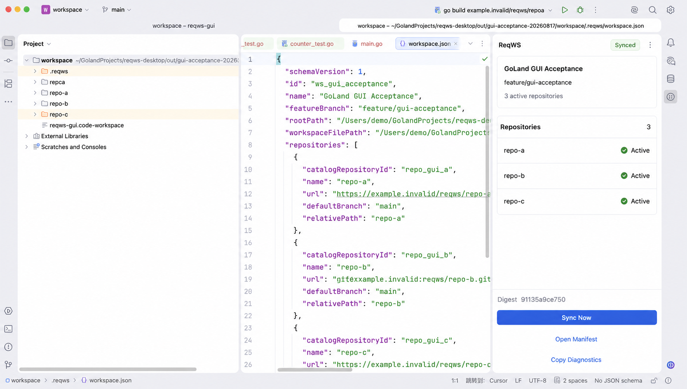
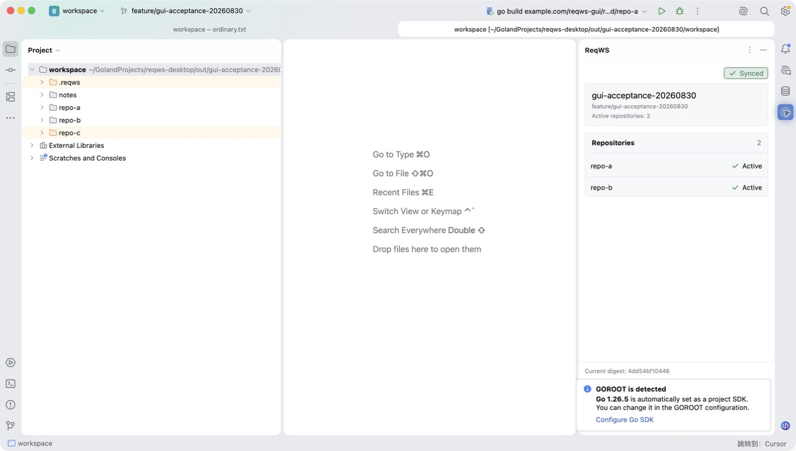

# GoLand Tool Window 视觉设计与实现对照

本文把 ReqWS Tool Window 的视觉目标固化为可实现、可截图对照的界面契约；原型用于指导实现，真实截图只代表待后续验收的候选界面。

## 1. 设计目标

- 保持 GoLand 2026.1 原生 Swing/JetBrains 主题观感，不引入 Web 风格仪表盘或自绘主题系统。
- 在常用窄 Tool Window 中先回答“当前是否同步成功、哪个工作区、有哪些活动仓库”，再提供诊断和恢复动作。
- 同步、降级、错误和 Safe Mode 同时使用文字与颜色表达；颜色只作辅助，不成为唯一状态信号。
- 仓库行保持紧凑且顶部对齐，避免旧实现把少量仓库拉伸成大块空白。
- 保留 `Sync Now`、`Open Manifest File` 和 `Copy Diagnostics` 的现有入口、资源键和安全边界，不新增按钮；`Sync Now` 重放 Project Model 与 live `ProjectFileIndex`/Go Modules registry reconcile 并重新检查 VCS，不自动修改 Directory Mappings。
- Git Root 缺失、同路径 VCS 冲突或 retained mapping 以文字说明用户前往 Settings → Version Control → Directory Mappings 手动处理；插件不以视觉状态暗示自动修复。
- manifest 提供的 workspace、branch 和 repository name 继续禁用 Swing HTML 自动渲染，并在空间不足时保留可访问的完整提示。

## 2. 同步态原型

原型由内置 ImageGen 的 `ui-mockup` 模式生成，并以旧版真实 GoLand 截图作为结构参考。提示词要求只优化右侧 ReqWS Tool Window，使用原生浅色 JetBrains 密度，形成状态标题、工作区摘要、三行仓库列表、摘要和分层操作区；禁止渐变、玻璃拟态、图表、装饰插画和额外操作。生成图中的 GoLand 外壳仅作视觉上下文，文字或项目树细节不作为产品事实。该图只定义布局；它没有展示 2026-08-18 新增的手动 Git Root 配置语义，不能作为该状态的验收证据。

## 3. 实施映射

| 原型区域 | 实现约束 |
|---|---|
| 状态标题 | Tool Window 自带标题保持不变；面板首行以内容宽度的状态徽标靠右展示，不使用满宽状态边框，状态色由当前 JetBrains 主题派生。 |
| 工作区摘要 | 使用带主题边界的独立卡片；workspace 名称作为主信息，branch 和活动仓库数量作为次级信息；长文本截断时 tooltip 保留完整值。 |
| 仓库列表 | 使用独立卡片；header 左侧为标题、右侧为纯数字 count；每行固定紧凑高度并带主题分隔线，包含 repository name、目录状态和 Git Root configured/需手动配置等文字语义及辅助色图标；present repository 只有 live `ProjectFileIndex` 与顶层普通 `go.mod` 对应的 Go Modules registry 均收敛后才显示 `Active`；1–6 行不显示滚动条，7 行起固定显示六行并在卡片内滚动。 |
| 诊断摘要 | 显示 digest、保留上次有效模型或无 manifest 提示；VCS 差异写明 Settings → Version Control → Directory Mappings；live project content 未收敛时显示 `PROJECT_CONTENT_NOT_CONVERGED`，错误码继续与状态文字同屏。 |
| 操作区 | `Sync Now` 为全宽主操作，但含义是“重新同步项目模型与 live projection 并检查 VCS”；trusted registry mismatch 可通过 guarded public ordinary roots event 请求 GoLand 原生刷新，Safe Mode 不发布该事件，插件不直接调用 Go scheduler/process 或 internal/reflection；另两个动作居中显示为次级链接，并保持原有 enable 规则。 |

布局必须随 Tool Window 宽度伸缩，不依赖固定像素宽度；滚动只发生在仓库区域，摘要和操作区始终可达。浅色与深色主题都使用平台颜色，不硬编码仅适配单一主题的背景或前景。

## 4. 状态与无障碍

| 状态 | 视觉语义 | 必须保留的文字语义 |
|---|---|---|
| synchronized | 成功色辅助标记 | authoritative Workspace Model、live `ProjectFileIndex`、Go Modules registry 与 VCS 只读诊断均收敛后才显示 `Synced` / `已同步` |
| reading、synchronizing | 信息色或进度语义 | 当前读取或同步文字 |
| degraded、VCS 待手动配置、Safe Mode | 警示色辅助标记 | 部分可用、Directory Mappings 手动步骤或信任提示 |
| degraded、project content 未收敛 | 警示色辅助标记 | `PROJECT_CONTENT_NOT_CONVERGED` 同时覆盖 live `ProjectFileIndex` 或 Go Modules registry 未收敛，并显示 `Project Content Unavailable` / `项目内容未生效`；present repository 不得显示 `Active` |
| error | 错误色辅助标记 | `Error` / `错误` 与稳定错误码 |
| inactive、disposed | 中性色 | 不可用或已关闭文字，且操作禁用 |

按钮保持原生键盘焦点和可访问名称。状态圆点属于装饰，不取代相邻文字；repository missing 仍显示完整的 `Directory Missing` / `目录缺失`。复制诊断后的反馈继续出现在摘要区域，不使用自动消失且不可复核的纯颜色提示。

## 5. 实现候选与真实 GUI 对照

| 同步态原型 | 2026-08-30 真实 GoLand 候选 |
|---|---|
|  |  |

右图来自 exact packaged Desktop 打开的固定无凭据 fixture，以及 GoLand 2026.1.3（`GO-261.25134.147`）浅色主题。插件冷启动后为 `Synced`：repo-a/repo-b 活动，repo-c retained；同屏可见紧凑状态徽标、带边界的 workspace/branch/count 摘要、仓库卡、digest、全宽 `Sync Now` 和居中的次级动作。实现继续服从 GoLand 原生 chrome、平台字体密度和主题颜色，不使用私有 API 或自绘整套主题强行复刻原型。

本图为 1355×768 PNG，文件 SHA-256 `27542e1be7e703051aad038a8364d626a0041660c017301e8507e74e89adc3c2`；对应 plugin ZIP SHA-256 `9746925dad410016187d1f9859829dfa77ca020d167f4a87f9261afbac6e2fc8`。它是“实现候选证据”，不表示 `PASS` 或 `GO`。同一轮真实 GUI 在后续 add/remove/re-add 中先发现 automatic refresh 与 live `ProjectFileIndex`/Project/Search 未收敛；这些修复后的后续候选又暴露 Go Modules registry 滞后：PACKAGE configuration 显示 `Cannot find package`，选择 `Continue Anyway` 后底层 Go test 虽成功，也没有改变配置校验失败。最终状态契约因此把 public registry 纳入 `Synced`/`Active` gate，并以同一个 `PROJECT_CONTENT_NOT_CONVERGED` 表达任一 live layer 未收敛；ordinary roots event 可能触发的 `go list`/下载必须单独归因给 GoLand。深色主题、错误、Safe Mode、最窄宽度、长 tooltip、键盘焦点、屏幕阅读器和 close/exit 生命周期也未执行。完整结论见[2026-08-30 GUI 验收报告](../testing/verification-2026-08-30.md)，其 verdict 以报告的最新结果为准。

[2026-08-17 实现截图](tool-window-implementation-2026-08-17.png)继续作为旧候选历史参考；它绑定不同 ZIP，不能替代当前 dated verification。
