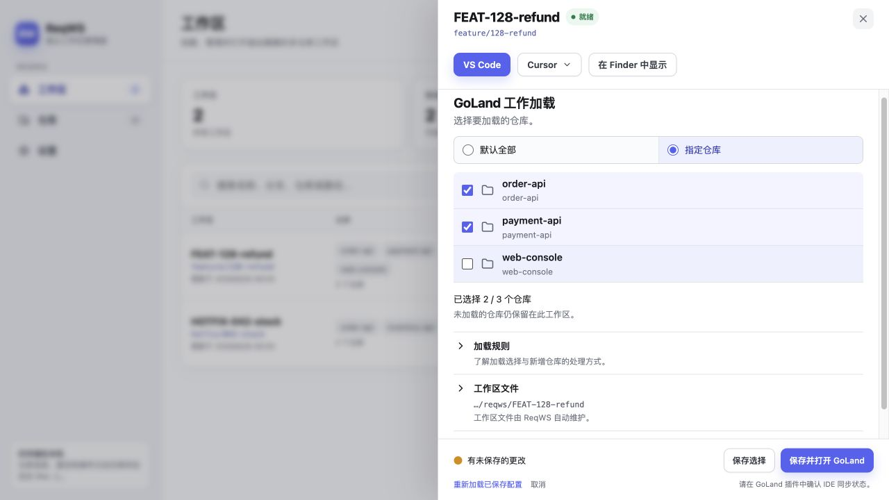

# ReqWS GoLand 插件图解

本指南以 **ReqWS v0.1.7 正式发布插件**为准，帮助你把工作区中的全部或部分仓库加载到 GoLand，并确认 IDE 中看到的目录与选择一致。

先在 Desktop 中[创建一个“就绪”的工作区](user-guide.md#第一次创建工作区)。Desktop 负责下载代码和维护成员；独立插件负责把你选择的目录显示在 GoLand 中。**安装 Desktop 不会自动安装插件。**

## 安装插件

### 先确认版本

在 GoLand 的 **Help → About**（macOS 也可在应用菜单查看 About）确认版本和 `GO-…` build，再选择匹配的插件包。

| 项目 | v0.1.7 的要求 |
|---|---|
| 插件包 | [ReqWS-0.1.7-goland-plugin.zip](https://github.com/fredgnr/reqws-desktop/releases/download/v0.1.7/ReqWS-0.1.7-goland-plugin.zip)，与 Desktop 独立安装。 |
| IDE | **GoLand 2026.2（262 系列）起**；不支持 261 系列，也不承诺可安装到其他 JetBrains IDE。 |
| 兼容上限 | v0.1.7 未设置描述符上限；这不代表所有未来版本都已实际验收。较新 GoLand 仍需通过 IDE 安装检查。 |
| 普通使用 | 已安装的 GoLand 即可；不需要为了安装 ZIP 另装 JDK 或 Node.js。 |

版本范围来自 [v0.1.7 的兼容政策](https://github.com/fredgnr/reqws-desktop/blob/v0.1.7/integrations/goland/compatibility.properties)和[构建描述](https://github.com/fredgnr/reqws-desktop/blob/v0.1.7/integrations/goland/build.gradle.kts)。固定的自动回归环境 2026.2.1.1 不是唯一可用版本，也不是最低版本。

### 从 ZIP 安装

1. 从 [v0.1.7 发布页](https://github.com/fredgnr/reqws-desktop/releases/tag/v0.1.7)下载 **`ReqWS-0.1.7-goland-plugin.zip`**，按同页校验信息核对资产。这个 ZIP 与 Desktop 的 `macos-arm64.zip` 是两个文件。
2. 在 GoLand 打开 **Settings → Plugins**，点击齿轮菜单，选择 **Install Plugin from Disk**。
3. 选择下载的插件 ZIP，确认插件为 **ReqWS**（ID：`com.reqws.workspace`），按 IDE 提示安装。
4. 如果 IDE 要求重启，先保存工作，再重启 GoLand；回到 **Plugins → Installed**，确认 ReqWS 已启用。

正式 Release 插件 ZIP 使用作者签名。若从 Marketplace 安装，是否可搜索、可安装或可更新以该版本实际审核结果为准；发布脚本支持自动提交并不等于已上架。磁盘安装路径不依赖市场审核。

已有插件需要更新时，也可用以上步骤安装对应版本 ZIP。只想使用插件，无需安装 JDK 或自行构建。需要从源码构建时准备 JDK 25，按[插件构建说明](../../integrations/goland/README.md#build-and-verify)操作；普通本地 ZIP 未签名。

## 在 Desktop 选择要加载的仓库

以退款工作区为例，它包含订单、支付和前端三个仓库。如果此时只在 GoLand 中写后端，可以只加载前两个。

1. 在 ReqWS 的“工作区”页，点击 `FEAT-128-refund` 右侧 `…`。
2. 找到 **GoLand 工作加载**。
3. 选择 **指定仓库**，保留 `order-api` 与 `payment-api`，取消 `web-console`。
4. 确认“已选择 **2 / 3** 个仓库”，点击 **保存并打开 GoLand**。



*图 1：这是 Desktop 中的实际操作界面，数据为虚构示例。黄色“有未保存的更改”表示尚未写入配置；需要点底部保存按钮。*

| 选择或按钮 | 作用 |
|---|---|
| **默认全部** | 加载当前全部成员；以后添加到该需求的仓库也自动纳入加载集合。 |
| **指定仓库** | 只加载勾选成员；以后新增的成员不会自动勾选。 |
| 指定模式下全部取消勾选 | 明确要求不加载任何受管仓库，不会自动恢复为“全部”。 |
| **保存选择** | 写入加载配置；适合 GoLand 已打开或稍后再打开。 |
| **保存并打开 GoLand** | 保存后打开对应 IDE 入口；仍需在 IDE 确认同步状态。 |
| **重新加载已保存配置** | 重新读取磁盘上的选择；发生版本冲突时，先核对草稿再使用。 |

取消加载不是移除需求成员，更不是删除仓库。`web-console` 仍留在磁盘上，也仍出现在 VS Code/Cursor 的 `.code-workspace` 中。真正增删成员使用详情里的**管理工作区**，不要混淆两个保存范围。

## 第一次在 GoLand 中打开

ReqWS 会准备并打开下面这个独立入口，而不是直接把工作区根目录当作插件项目：

```text
FEAT-128-refund/
├── order-api/                        # 业务代码
├── payment-api/
├── web-console/
└── .reqws/
    ├── workspace.json                # 成员清单
    └── ide/goland/                   # Desktop 打开的 GoLand 入口
        ├── reqws-project.json        # 工作区绑定和加载选择
        └── .idea/
```

第一次打开，GoLand 可能询问是否信任项目。只在确认这些仓库可信时选择信任；处于 **Safe Mode** 时，插件只读展示，尚不应用受管目录。不要手工复制旧 `.idea` 或预先创建这个入口。

进入 GoLand 后，打开 **View → Tool Windows → ReqWS**。等待 ReqWS 面板完成读取和同步，再到左侧 **Project** 面板展开具体仓库。

对于刚才的选择，普通 Project 视图应能看到两个后端目录。下面是**目录关系示意，并非 IDE 截图**；实际分组和图标可能随 GoLand 版本变化：

```text
ReqWS 工作区成员                 GoLand 本次加载
✓ order-api       ───────────→  order-api/
✓ payment-api     ───────────→  payment-api/
  web-console                    不在 ReqWS 受管加载集合中
                                 （代码仍保留在磁盘）
```

**完成标志：** ReqWS 面板中的选择/状态符合预期，且能在 Project 面板展开已选仓库中的实际文件。正常同步后，内部入口不会作为业务目录显示。“已同步”只表示 ReqWS 的目录适配完成，不代表 Go SDK、依赖、补全、运行配置或测试已经就绪。

如果你另外手工添加过项目 roots，这些用户内容会保留。因此取消所有 ReqWS 仓库后，Project 面板不一定完全空白；Libraries、Scratches 等 IDE 内容也可继续显示。

## 以后怎样调整加载范围

在 Desktop 中修改勾选并**保存选择**，插件会读取新配置并同步。已打开的 IDE 中必要时点击 **立即同步 / Sync Now**，强制重新检查；这个按钮不会替你改变 Desktop 中的选择。

| ReqWS 面板中的状态/动作 | 怎样理解或使用 |
|---|---|
| 已加载 | 当前选择中的目录已进入验证后的项目内容范围。 |
| 未加载 | 仍是需求成员，但未被本次选择，属于正常状态。 |
| 目录缺失 | 请求加载的目录不存在；选择意图仍保留。 |
| 仍被其他项目根包含 | 用户或其他配置仍覆盖该目录，插件会保留这些配置。 |
| 项目内容未生效 / 错误 | 当前配置未通过模型、文件索引边界或所有权检查，先查看诊断。 |
| 打开清单文件 / Open Manifest File | 查看 Desktop 维护的成员清单；不是推荐的手工编辑入口。 |
| 复制诊断信息 / Copy Diagnostics | 收集插件版本、状态和错误，便于报告问题。 |

## Git Roots 需要单独确认

插件只读检查已加载仓库的 Git Directory Mappings，不会自动增删它们。如果 GoLand 没有按你期望显示 Git 仓库，进入 **Settings → Version Control → Directory Mappings** 手动检查各仓库路径。

“未加载”不会自动删除 Git mapping，也不保证 Git Log/Commit 视图缩小。插件不会 clone、fetch、checkout、访问仓库 URL 或修改语言/构建配置；Git 操作由 Desktop 创建流程或用户的原生 Git/IDE 操作承担。

## 看不到仓库时按这个顺序检查

1. **Desktop 是否“就绪”？** 先检查目录是否存在，以及成员是否属于这项需求。
2. **选择是否已保存？** “有未保存的更改”只是草稿。核对计数和勾选，再保存。
3. **插件是否启用且兼容？** 在 Plugins → Installed 中检查 ReqWS。
4. **是否从 ReqWS 打开了正确入口？** 普通代码根目录和无绑定目录不会启用这一受管模型。回到 Desktop 用“保存并打开 GoLand”。
5. **是否仍处于 Safe Mode？** 未信任时只展示，不写入受管项目模型。
6. **面板有什么诊断？** 必要时立即同步并复制诊断。访问失败先检查权限；版本冲突先重新加载已保存配置；所有权/绑定冲突先保留现场并核对来源。

临时写入失败时，已有绑定的选择草稿通常可以在权限或磁盘问题修复后直接重试；绑定或版本冲突则需要重新加载。未知或中断留下的入口不会被自动认领、清空；不要通过删除 `.idea`、ledger 或仓库来强行消除错误。

本文的 Desktop 截图只解释交互位置，不是该插件 ZIP 的真实 IDE 验收证据。详细边界与按次验证范围见[技术方案](../changes/goland-workspace-loading/technical-design.md)、[实施记录](../changes/goland-workspace-loading/implementation-2026-09-19.md)；发布版兼容材料应查看对应 tag。

返回[Desktop 图解教程](user-guide.md) · [安装与更新](installation.md) · [指南目录](README.md)。
