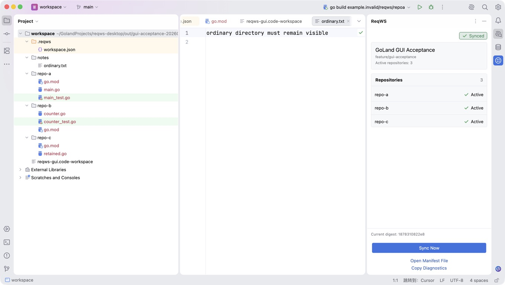

# ReqWS GoLand 插件使用指南

本指南说明如何从可信源码编译、安装和使用 ReqWS GoLand 插件，并逐区解释 ReqWS Tool Window 的状态、仓库列表、诊断信息和操作入口。

## 1. 插件解决什么问题

ReqWS Desktop 在每个工作区根目录维护 `.reqws/workspace.json`。其中 `repositories` 是当前活动仓库集合；已逻辑移除的仓库可能仍留在磁盘，但不再属于当前 IDE 工作区。

GoLand 插件只读这份 manifest，并把活动仓库投影到 GoLand 的项目范围和 Git roots。它负责同步 IDE 视图，不负责仓库生命周期：

- 不 clone、fetch、checkout、pull、merge、rebase 或 push；
- 不从 GoLand 添加或移除 ReqWS 仓库；
- 不删除工作区或仓库目录；
- 不生成或修改 `go.work`；
- 不访问 manifest 中的 repository URL；
- 不把 GoLand 中的变化回写到 ReqWS Desktop。

ReqWS Desktop 仍是 manifest、仓库增删和功能分支的唯一控制面。

## 2. 使用条件与当前分发方式

- macOS 本地 GoLand；插件 `since-build` 为 261，编译目标是 GoLand 2026.1.3。
- 从源码构建需要 Node.js 24、npm、JDK 21、Git，以及首次下载 Gradle、GoLand SDK 和依赖的网络与磁盘空间。
- 插件当前只生成本地 ZIP，不签名，不发布到 JetBrains Marketplace 或自定义插件仓库，也没有自动更新。
- ZIP 只能从可信的 ReqWS checkout 构建；不要安装来源不明或无法对应到源码的同名文件。

需要自动化构建和安装时，可以在支持项目 Skills 的 Codex 中手动选择 `$reqws-goland-plugin-install`。该 Skill 被配置为不能隐式触发；普通 GoLand、Gradle 或插件请求不会自动加载它。

## 3. 编译插件 ZIP

在仓库根目录执行：

```bash
# 使用 nvm 管理 Node.js 时先选择仓库声明的 Node 24
nvm use
npm run package:goland
```

产物位于：

```text
integrations/goland/build/distributions/
```

准备 PR 或需要完整兼容性证据时，先运行独立插件门禁，再构建 ZIP：

```bash
# 使用 nvm 管理 Node.js 时先选择仓库声明的 Node 24
nvm use
npm run check:goland
npm run package:goland
```

`check:goland` 会运行插件测试、项目/结构检查和配置的 GoLand 2026.1.3/2026.2 Plugin Verifier。成功构建只证明产物可生成；它不能代替真实 GoLand 的 Project、Search、Git、Go 功能和生命周期验收。

## 4. 从磁盘安装或更新

1. 在 GoLand 打开 **Settings → Plugins**。
2. 选择 Plugins 页面上的齿轮菜单。
3. 选择 **Install Plugin from Disk**。
4. 选择刚生成的 `integrations/goland/build/distributions/*.zip`。
5. 核对插件名称为 **ReqWS**，再确认安装。
6. 按 GoLand 提示保存正在编辑的文件并重启 IDE。
7. 重启后回到 **Settings → Plugins → Installed**，确认 ReqWS 已启用。

更新本地插件时重复相同步骤，选择新构建的 ZIP。不要把 ZIP 解压后手工复制到 JetBrains 插件目录，也不要通过清空缓存来替代正常安装或排障。

若需要停用或移除插件，从 **Settings → Plugins → Installed → ReqWS** 使用 GoLand 原生的 Disable 或 Uninstall 操作，并按提示重启。停用插件只会停止后续投影；它不会删除磁盘上的 ReqWS 工作区或仓库。

## 5. 打开正确的工作区

推荐从 ReqWS Desktop 的工作区列表或详情选择 **GoLand**。Desktop 会重新确认工作区为“就绪”，校验 root 和 manifest，再把 workspace root 交给已验证的 GoLand app。

也可以在 GoLand 中直接打开目录，但必须选择包含下列固定文件的 **workspace root**：

```text
<workspace-root>/.reqws/workspace.json
```

不要打开单个仓库子目录，也不要把 `.code-workspace` 当作 GoLand 项目文件；GoLand 插件读取的是 workspace root 下的 manifest。

## 6. 首次打开、项目信任与 Safe Mode

首次打开项目时，使用 GoLand 自带的 Trusted Project 流程决定是否信任。ReqWS 插件不会替你点击信任，也不会把项目直接标记为 trusted。

在 Safe Mode 中，插件只读取并展示 manifest 和诊断：

- 不修改项目模型或 Git roots；
- 不启动外部进程；
- 不执行仓库中的代码、脚本或构建；
- Tool Window 显示 **Safe Mode / 安全模式** 和信任提示。

通过 GoLand 原生流程信任项目后，插件会停止信任检查并向同一个串行同步流程提交一次同步。

## 7. Tool Window 界面导览



[打开原尺寸截图](../changes/goland-plugin-support/ui/tool-window-implementation-2026-08-17.png)。该图来自真实 GoLand 的同步态实现候选，只用于定位界面；它不代表完整 GUI `PASS` 或 `GO`。

从上到下，Tool Window 分为以下区域：

| 位置 | 区块 | 作用 |
|---|---|---|
| 标题栏 | **ReqWS** | GoLand 原生 Tool Window 标题和窗口操作；不是插件同步状态。 |
| 内容顶部 | 状态徽标 | 显示插件当前生命周期，例如 `Synced`、`Safe Mode`、`Partially Available` 或 `Error`。状态不是 Git 工作树是否干净、远端是否最新，也不是测试结果。 |
| 第一张卡片 | 工作区摘要 | 主行是 manifest 的 workspace `name`；下一行是 `featureBranch`；最后一行是 manifest 声明的活动仓库数量。插件只展示 branch 元数据，不执行 checkout，也不证明各仓当前分支一致。 |
| 第二张卡片 | Repositories | 标题右侧是活动条目数；每行显示 repository name 和目录状态。1–6 行不显示滚动条，7 行起固定展示六行并只在卡片内部滚动。 |
| 底部摘要 | digest、提示或错误 | 正常时显示最近成功应用摘要的前 12 位；它是 manifest 内容摘要，不是 Git commit。错误时显示稳定错误码和保留旧模型提示；Safe Mode 显示信任提示。 |
| 操作区 | 主操作与次级操作 | `Sync Now` 是全宽主操作；`Open Manifest File` 和 `Copy Diagnostics` 是次级操作。 |

插件资源文案跟随 GoLand locale，当前提供英文和简体中文。动作会按 lifecycle 禁用：关闭或非 ReqWS 项目不允许操作，读取中的重复同步会被禁用，不能执行的链接显示为不可用。

### 仓库行状态

| 状态 | 含义 | 建议操作 |
|---|---|---|
| `Active / 活动` | manifest 声明该仓库，且读取时目录存在。它不单独证明 Git mapping、远端或分支健康。 | 通常无需操作；结合顶部同步状态判断整体投影是否完成。 |
| `Directory Missing / 目录缺失` | manifest 仍声明该仓库，但目录不存在。插件不会创建目录或 clone。 | 回到 ReqWS Desktop 检查工作区详情并恢复仓库，或确认 manifest 是否来自预期工作区。 |

活动仓库计数包含 `Directory Missing` 条目，因为它表达 manifest 的目标集合，而不是磁盘上当前存在的目录数。

## 8. 三个操作入口

### Sync Now / 立即同步

跳过 VFS 文件事件的防抖等待，重新读取固定 manifest，并进入与自动同步相同的串行、latest-wins 协调器。

它不会：

- 写入或修复 manifest；
- clone、checkout、pull 或访问 repository URL；
- 绕过 Safe Mode；
- 删除目录；
- 强行覆盖所有权不明的用户 Content Root、exclude 或 VCS mapping。

适用于文件事件丢失、Mac 睡眠恢复、错误修正后重试，或需要立即核对当前 manifest 的场景。

### Open Manifest File / 打开清单文件

在 GoLand 编辑器中打开当前 workspace root 的固定文件：

```text
.reqws/workspace.json
```

该操作只定位并打开文件，不创建、修复或写回内容。ReqWS Desktop 是唯一 writer；排障时可以检查字段和错误位置，但不要把手工编辑 manifest 当作日常仓库增删流程。

### Copy Diagnostics / 复制诊断信息

把以下诊断写入系统剪贴板：

- 插件版本和 GoLand build；
- 项目模型策略与 lifecycle；
- 脱敏后的 project root 和 manifest path；
- 最近应用摘要与当前 candidate 摘要；
- repository 数量和缺失数量；
- 稳定错误码与字段。

诊断不包含 repository URL、remote、Token、manifest 全文或仓库文件内容。脱敏路径仍可能保留相对目录名；粘贴到 issue、聊天或外部系统前应先检查剪贴板文本。

## 9. 生命周期状态

| 状态 | 含义 | 恢复建议 |
|---|---|---|
| `Reading… / 正在读取…` | 正在初次读取或重新读取 manifest。首次尚未确认 manifest 时 Tool Window 通常不显示。 | 等待读取完成；持续停留时检查固定 manifest 是否可访问。 |
| `Safe Mode / 安全模式` | manifest 可读，但项目未被 GoLand 信任；插件保持只读。 | 仅在确认项目来源后，通过 GoLand 原生流程信任项目。 |
| `Syncing… / 正在同步…` | 正在依次收敛项目模型和 VCS mappings。 | 等待完成，不要用重复点击制造无意义重试。 |
| `Synced / 已同步` | 项目模型和 VCS 都已成功应用，摘要已推进。 | 无需操作。 |
| `Partially Available / 部分可用` | 至少一部分安全投影可用，但存在目录缺失、VCS 应用失败或所有权冲突。 | 查看仓库行和底部错误，修复根因后选择 `Sync Now`。 |
| `Error / 错误` | manifest candidate 被拒绝，或项目模型应用失败。已有有效 snapshot 时继续显示并保留上次有效模型。 | 先复制诊断并按错误码区分输入错误与 IDE 项目模型错误，不要默认修改 manifest。 |
| `Not a ReqWS Project / 非 ReqWS 项目` | 当前 root 没有固定 manifest，且没有可保留的旧 snapshot。普通项目通常不显示 Tool Window；存在但无效的 manifest 会进入 `Error`。 | 打开正确的 workspace root，不要在普通项目中创建伪 manifest。 |
| `Closed / 已关闭` | 项目服务已经进入终态。 | 所有动作停用；重新打开项目会创建新的服务并重新收敛。 |

## 10. 日常工作流

### Desktop 添加仓库

1. 在 ReqWS Desktop 中向工作区添加仓库。
2. Desktop 完成 clone、分支切换并原子更新 manifest。
3. GoLand 插件观察最新文件并自动同步。
4. 新仓库出现在 Repositories 卡片和 Git roots 中。

### Desktop 逻辑移除仓库

1. 在 ReqWS Desktop 中移除仓库。
2. Desktop 只从 manifest 和 `.code-workspace` 移除记录；目录仍保留。
3. 插件仅在能证明 ReqWS 所有权时移除自己管理的 exclude 或 Git mapping。
4. 保留目录不再属于活动集合；插件不会删除它。

### 重新添加与冷启动

重新添加同一仓库后，插件恢复安全投影且不制造重复 root 或 mapping。GoLand 重启时会重新读取 manifest 并收敛；不要求 ReqWS Desktop 同时运行，也不会仅凭持久摘要跳过重建。

## 11. 故障排查

### 看不到 ReqWS Tool Window

- 确认 ReqWS 插件已安装并启用；
- 确认打开的是 workspace root，而不是 repository 子目录；
- 确认 `<workspace-root>/.reqws/workspace.json` 存在；
- 若插件刚安装或更新，按 GoLand 提示完成重启；
- 普通非 ReqWS 项目有意不显示 Tool Window。

### 一直处于 Safe Mode

确认项目来源后使用 GoLand 原生 Trusted Project 操作。不要手工编辑插件状态，也不要期望 `Sync Now` 绕过信任门禁。

### 显示 Directory Missing

检查 ReqWS Desktop 工作区详情和磁盘目录。插件不会 clone 缺失仓库；应通过 Desktop 的受管流程恢复或修正活动集合。修复后等待自动同步，必要时选择 `Sync Now`。

### 显示 Partially Available

底部摘要可能显示 `REPOSITORY_MISSING`、`VCS_MAPPING_APPLY_FAILED` 或 `OWNERSHIP_CONFLICT`。插件会保留能够安全应用的部分以及上次有效内容，不会为追求“全绿”覆盖所有权不明的用户配置。先核对缺失目录、Git roots 和用户自定义 mappings；修复根因后选择 `Sync Now`。

### 显示 Error

先记录稳定错误码，并使用 `Copy Diagnostics` 保存脱敏上下文，再按类别处理：

- manifest/路径错误：`MANIFEST_*`、`UNSUPPORTED_MANIFEST_VERSION`、`WORKSPACE_ROOT_MISMATCH`、`REPOSITORY_*`。选择 `Open Manifest File` 查看固定文件，并通过 Desktop 修复受管输入；若文件不存在或不是普通文件，该动作无法打开内容，应直接核对固定路径。
- 项目模型错误：`PROJECT_MODEL_APPLY_FAILED`。manifest 可能完全有效；先等待 IDE indexing/项目状态稳定后选择 `Sync Now`，仍失败时保存诊断、检查 GoLand 日志或重开项目，不要盲目改 manifest 或清空 `.idea`。

`VCS_MAPPING_APPLY_FAILED` 与 `OWNERSHIP_CONFLICT` 通常表现为 `Partially Available`；`SAFE_MODE_BLOCKED` 表现为独立的 Safe Mode 状态，而不是 Error 错误码。

不要为了消除错误而删除目录、清空 `.idea`、篡改 ownership state 或手工批量改 VCS mappings。保留现场和诊断，先修正 Desktop 管理的输入或用户配置冲突。

## 12. 数据与安全边界

- `.reqws/workspace.json` 按不可信、只读输入处理；Desktop 是唯一 writer。
- Safe Mode 下没有项目模型、VCS 或外部进程副作用。
- 插件只删除能以持久 state 与当前模型双重证明归 ReqWS 所有的条目；不确定时保留并降级。
- 逻辑移除和停用插件都不会删除磁盘仓库。
- 插件不提供 Git 生命周期、仓库增删、分支、`go.work` 或 Desktop 控制按钮。
- 真实截图和诊断在分享前仍需检查项目名、目录名和其他环境信息。

## 13. 当前限制与进一步资料

- 当前只支持本地 macOS GoLand，不支持 Windows、Linux、IntelliJ IDEA、Fleet 或 Remote Development。
- 插件没有签名、Marketplace 分发、自动安装或自动更新。
- 当前候选对 GoLand 2026.2 只有 Plugin Verifier Compatible 证据，尚无 2026.2 真实 GUI/功能验收。
- 同步态截图只覆盖一个候选界面，不代表深色主题、错误、降级、Safe Mode、最窄宽度或完整生命周期都已验收。

进一步资料：

- [ReqWS 使用说明](user-guide.md)：Desktop 的仓库、工作区、设置、恢复和数据保护。
- [ReqWS 开发指南](development-guide.md)：插件构建、测试、兼容与开发约束。
- [GoLand 插件支持需求包](../changes/goland-plugin-support/README.md)：manifest、项目模型、VCS、安全和当前验证状态。
- [Tool Window 视觉设计与实现对照](../changes/goland-plugin-support/ui/tool-window-visual-design.md)：原型、真实候选截图和平台差异。
