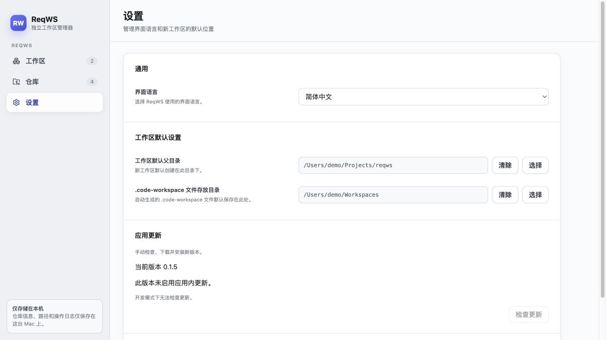
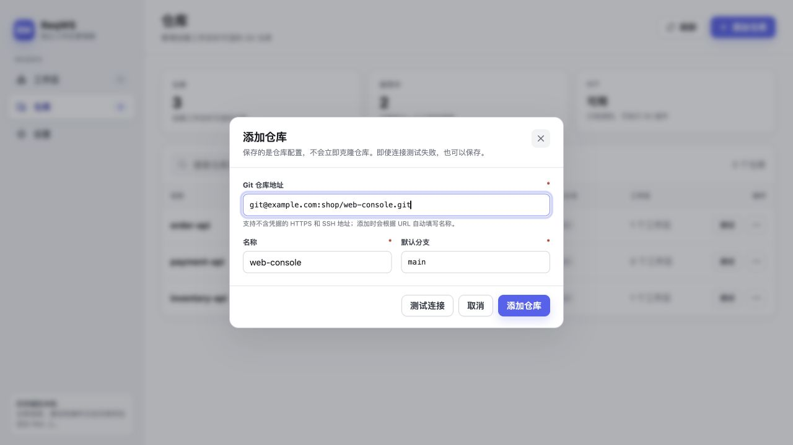
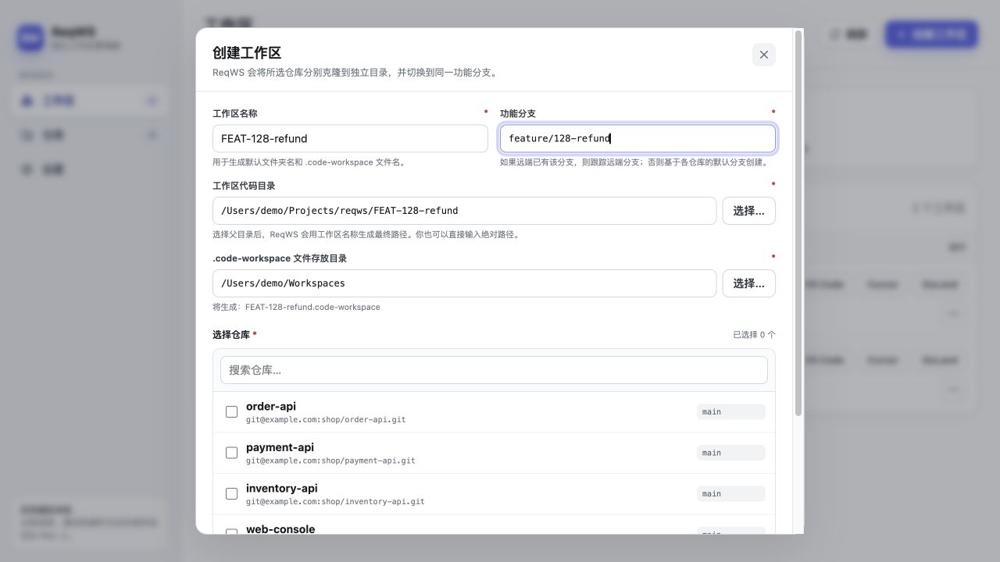
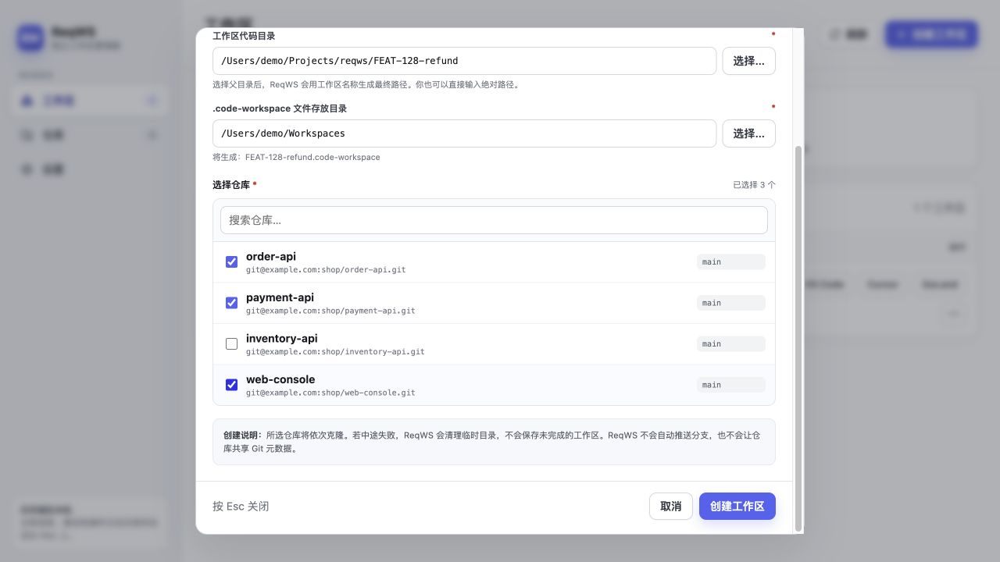
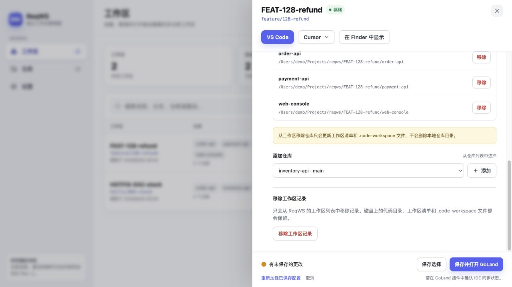

# ReqWS 图解使用教程

本教程用“退款功能需要修改三个仓库”的例子，带你完成仓库配置、工作区创建、编辑器打开和日常维护。

还没有安装应用？先看[安装与更新](installation.md)。只想了解项目用途？看[项目首页](../../README.md)。本文示例地址和 `/Users/demo/…` 路径均为虚构，请换成自己的仓库和目录。

- [先认识三个概念](#先认识三个概念)
- [第一次创建工作区](#第一次创建工作区)
- [创建之后磁盘上有什么](#创建之后磁盘上有什么)
- [日常维护与收尾](#日常维护与收尾)
- [状态与常见问题](#状态与常见问题)
- [数据位置、备份与恢复](#数据位置备份与恢复)

截图由当前 Desktop 界面配合示例数据生成，展示操作位置，不代表截图中的远端真实可连接。发布版的界面可能略有差异；[图片说明](images/README.md)记录截图来源。[本分支整改](../changes/code-humanizer-review/remediation.md)中的保留名称拒绝、clone 无输出超时、权限错误分类等新行为尚未作为新版发布，下文标为“整改候选”。

## 先认识三个概念

| 界面/文件 | 它是什么 | 例子 |
|---|---|---|
| **仓库** | 可复用的 Git 地址配置。保存后不会立即 clone，也不是在导入已有本地目录。 | `order-api` → 你的订单仓库地址，默认分支 `main`。 |
| **工作区** | 为一项需求生成的代码目录，包含若干仓库的完整独立副本。 | `FEAT-128-refund` 包含订单、支付、前端三个仓库。 |
| **`.code-workspace`** | ReqWS 生成的 VS Code/Cursor 多目录入口文件；代码本身放在另一个目录中。 | `FEAT-128-refund.code-workspace`。 |


这里的“隔离”指代码目录和 Git 元数据独立。数据库、服务端口、环境变量和依赖缓存仍由你的开发环境管理。各仓库也仍有自己的提交历史，不会合成一个大仓库。

## 第一次创建工作区

### 第 1 步：确认 Git 能访问你的仓库

准备好 Git 和至少一个希望使用的编辑器。只安装 Desktop 不需要 Node.js 或 JDK。打开 ReqWS 后进入“仓库”，页面上的 Git 状态应为“可用”。

ReqWS 使用系统 Git 的认证配置，不会在应用里弹出密码或 SSH host key 问答。第一次连接某个远端前，先在终端用**自己的真实地址**验证：

```bash
git ls-remote --symref -- git@你的Git主机:团队/仓库.git HEAD
```

能看到远端引用，才说明这台 Mac 的 Git 可以访问该地址。SSH 首次连接时先核实主机指纹；带口令私钥可先用 `ssh-add ~/.ssh/id_ed25519` 加载到 Agent。HTTPS 使用已配置的 credential helper。地址中不要放账号密码、Token、query 凭据或私钥内容。

| 可用地址形式 | 示例，不能直接用于本教程连接 |
|---|---|
| HTTPS | `https://example.com/shop/order-api.git` |
| SSH URI | `ssh://git@example.com/shop/order-api.git` |
| SSH 简写 | `git@example.com:shop/order-api.git` |

本地路径、`file://`、明文 HTTP 和 Git remote-helper 地址不支持。已有本地 clone 也不能直接登记成工作区。

### 第 2 步：设置代码与入口文件的默认位置

点击左侧“设置”，用“选择”按钮选两个**已经存在**的目录，再点击页面底部“保存设置”。也可以留空，在创建时逐次选择。



*图 1：两个目录用途不同。保存按钮在页面底部，窗口较小时需向下滚动。图中的“开发模式下无法检查更新”属于截图环境，正式个人签名包的更新入口见[安装指南](installation.md#个人签名版本的应用内更新)。*

| 设置项 | 示例 | 实际用途 |
|---|---|---|
| 工作区默认父目录 | `/Users/demo/Projects/reqws` | 新工作区的代码目录放在这里，每项需求占一个子目录。 |
| `.code-workspace` 文件存放目录 | `/Users/demo/Workspaces` | 存放编辑器入口文件，不存放仓库代码。 |
| 界面语言 | 简体中文、English、跟随系统 | 保存后切换当前界面，重启后保留。 |

### 第 3 步：把要用的仓库加入列表

点击“仓库 → 添加仓库”。本例依次登记 `order-api`、`payment-api` 和 `web-console`。



*图 2：保存的是一条仓库配置，此时还没有下载代码。图中以 `web-console` 为例。*

1. **Git 仓库地址：** 填入你刚验证过的地址。
2. **名称：** 默认从地址推导，也可修改。它将成为工作区中的子目录名；不同仓库名称不能冲突。
3. **默认分支：** 填远端实际存在的分支，例如 `main` 或 `develop`。创建新功能分支时会从它出发。
4. 点击**测试连接**。成功时会显示远端默认分支；如与填写值不同，手动修正。失败不会阻止保存，但应在创建工作区前解决认证或网络问题。
5. 点击**添加仓库**。列表出现这条记录后，用同样方法添加另外两个仓库。

不要使用空名称、`.`、`..`、带路径分隔符的名称；整改候选还会拒绝 `.reqws`、`.git` 及大小写变体。这些名称会与管理目录重叠。

**完成标志：** “仓库”页能看到要使用的三条记录。以后创建其他需求时，可直接复用这些配置。

### 第 4 步：为这项需求创建工作区

回到“工作区”，点击右上角**创建工作区**。先填写表单上半部分：



*图 3：先确认名称、分支和两个路径，再向下滚动选择仓库。*

| 字段 | 本例填写 | 应怎样理解 |
|---|---|---|
| 工作区名称 | `FEAT-128-refund` | 在列表中识别需求，也用于生成默认目录和文件名。 |
| 功能分支 | `feature/128-refund` | 所选仓库都会切换到这个分支名；不同仓库的提交历史仍然独立。 |
| 工作区代码目录 | `/Users/demo/Projects/reqws/FEAT-128-refund` | **最终的新目录**，必须尚不存在。“选择…”挑的是父目录，应用会追加工作区名；也可以直接输入最终绝对路径。 |
| `.code-workspace` 文件存放目录 | `/Users/demo/Workspaces` | **已有目录**，将在其中新建 `FEAT-128-refund.code-workspace`。 |

向下滚动，勾选 `order-api`、`payment-api`、`web-console`，再点击**创建工作区**。



*图 4：只勾选本需求需要的仓库。截图里的 `inventory-api` 留给另一项需求，不加入本工作区。*

ReqWS 会按顺序 clone 并准备分支，最后写入管理文件。分支选择规则是：有本地同名分支就使用它；否则跟踪已有远端同名分支；都没有时，从各仓库的远端默认分支创建。整改候选在最后一种情况下不为新 feature 设置默认分支 upstream。

操作期间保持 ReqWS 运行，等到显示完成后关闭进度窗口。最终目录和同名入口文件不能已存在，应用不会覆盖它们。失败时先阅读错误：未公开的临时目录会清理；已经公开的完整工件会保留，供恢复使用。

### 第 5 步：确认“就绪”，打开编辑器


*图 5：退款需求与库存修复拥有不同目录。以后切换任务时，从对应行打开即可。*

**完成标志：** 工作区出现在列表，状态为“就绪”，详情中的目录和成员与创建时一致。“就绪”不代表依赖已安装、数据库已启动或代码测试已通过。

| 入口 | 打开什么 | 还需要做什么 |
|---|---|---|
| **VS Code** | 该需求的 `.code-workspace`，一次看到全部成员仓库。 | 在各仓库中安装依赖、运行项目和处理 Git。 |
| **Cursor** | 列表按钮打开 `.code-workspace`；详情的 Cursor 菜单还可选择代码目录。 | 按你的工作方式选择入口。 |
| **GoLand** | ReqWS 准备的独立 IDE 入口。 | 先单独安装插件，按[插件指南](goland-plugin-guide.md)选择仓库并确认同步。 |
| **`…` → 在 Finder 中显示** | 工作区代码目录。 | 可检查实际生成的目录结构。 |

编辑器按钮灰色时，先确认相应编辑器已安装、工作区路径完整，再点“刷新”。

之后仍按平常方式在 IDE 或终端中 commit、pull、push、合并及创建 PR。ReqWS 不会自动发布功能分支。第一次发布新分支时，可在对应仓库内显式执行 `git push -u origin feature/128-refund`。

## 创建之后磁盘上有什么

本例对应以下结构；`.git` 和 `.reqws` 是隐藏目录：

```text
/Users/demo/Projects/reqws/
├── FEAT-128-refund/                 # 退款需求的代码目录
│   ├── order-api/.git/              # 独立 Git 元数据
│   ├── payment-api/.git/
│   ├── web-console/.git/
│   └── .reqws/workspace.json        # ReqWS 的成员清单
└── HOTFIX-042-stock/                # 另一项需求，独立的代码副本
    ├── order-api/.git/
    ├── inventory-api/.git/
    └── .reqws/workspace.json

/Users/demo/Workspaces/
├── FEAT-128-refund.code-workspace   # VS Code / Cursor 入口
└── HOTFIX-042-stock.code-workspace
```

使用 GoLand 时，还会在工作区根目录下建立 `.reqws/ide/goland/`。通常从 ReqWS 打开即可，不需要手工管理这个入口。仓库业务文件放在各仓库目录里；图中的 `.git/` 只是说明每份代码有自己的 Git 元数据。

## 日常维护与收尾

### 修改一项需求包含哪些仓库

点击工作区右侧 `…`，展开**管理工作区**。需要向下滚动时，详情底部的 GoLand 保存区仍固定可见。



*图 6：这是详情下半部分。成员管理按钮立即执行对应的确认或操作；底部“保存选择”仅保存 GoLand 加载配置，不负责保存成员增删。*

| 你想做什么 | 在哪里操作 | 磁盘内容会怎样 |
|---|---|---|
| 这项需求又需要一个仓库 | 管理工作区 → 添加仓库 | clone 新仓库并准备同名功能分支；符合检查条件的既有目录可复用。若下拉框没有它，先到“仓库”页登记。 |
| 这项需求不再包含某个仓库 | 成员行 → 移除 → 确认 | 从成员清单和 `.code-workspace` 移除，**保留本地目录及修改**。 |
| 只想让 GoLand 暂时少加载一些目录 | GoLand 工作加载 → 指定仓库 → 保存选择 | 成员和磁盘代码都保留，VS Code/Cursor 的入口文件不变。 |
| 只删除可选地址配置 | 仓库页 → 对应行 `…` → 删除仓库记录 | 已创建工作区保留自己的配置快照，不会跟随删除。 |
| 需求做完，从列表收起它 | 管理工作区 → 移除工作区记录 → 确认 | 只遗忘 ReqWS 索引，代码目录、manifest 和入口文件均保留。 |

在需求收尾前，先自行检查每个仓库的未提交修改和未推送提交。ReqWS 的移除记录功能不会替你检查分支是否已经合并；它也不是归档/重新导入机制。当前没有将遗忘后的目录重新导入列表的流程。真正回收磁盘空间需要你核对并备份后自行处理目录。

### 修改默认目录或仓库地址

设置中的默认目录只预填**下一次**创建表单，不会移动已有代码。仓库列表里修改名称、URL 或默认分支，也不会改写旧工作区保存的仓库快照。

`.code-workspace` 由 ReqWS 整体生成，不合并其中的手工 settings。不要依靠直接编辑它维护长期自定义内容；需要恢复入口文件时使用应用中的同步/重新生成操作。

## 状态与常见问题

| 看到什么 | 先检查什么 | 下一步 |
|---|---|---|
| **路径缺失** | 详情列出的代码目录、manifest、入口文件是否还在。 | 恢复原路径；若仅 `.code-workspace` 缺失且 root/manifest 完整，可在详情中同步恢复。 |
| **异常** | 错误码、阶段和技术详情。 | 保留现场，按错误处理后再刷新或同步，避免用同名目录覆盖。 |
| **未找到 Git** | 终端是否能运行 Git；从 Finder 启动的应用能否找到 Git。 | 安装或修复 Git 后刷新。此时仍可编辑仓库配置和设置。 |
| **连接/clone 失败** | 同一 URL 的 `git ls-remote` 是否成功；SSH Agent、host key、credential helper 和网络。 | 先修复访问问题再重试。不要把密码放进 URL。 |
| **默认分支不存在** | 仓库填写的是 `main`、`master` 还是其他远端分支。 | 改为真实存在的分支后重新创建。 |
| **目录或文件已存在** | 最终代码路径、同名 `.code-workspace` 或旧索引是否占用。 | 选择新路径；先核对旧记录，不能靠覆盖解决。 |
| **`WORKSPACE_PATH_UNAVAILABLE`（整改候选）** | 文件权限、磁盘是否可访问。 | 恢复访问后刷新；“不可访问”不等于“已删除”。 |
| **clone 超时（整改候选）** | Git 是否连续 15 分钟没有输出。 | 检查远端和网络后重试。有进度会重置期限；当前没有用户取消按钮。 |
| **GoLand 看不到仓库** | 插件已安装并启用？入口和加载选择正确？ | 按[GoLand 排障顺序](goland-plugin-guide.md#看不到仓库时按这个顺序检查)确认。 |

错误面板提供**复制错误日志**。报告问题时带上应用版本、操作步骤、错误码和阶段；分享前检查日志，不要提交凭据或私钥。

## 数据位置、备份与恢复

| 数据 | 典型位置 | 作用 |
|---|---|---|
| 全局状态 | `~/Library/Application Support/ReqWS/reqws/state.v1.json` | 仓库配置、工作区索引和设置。 |
| 工作区成员清单 | `<代码目录>/.reqws/workspace.json` | 这项需求的成员及路径快照。 |
| 代码 | `<代码目录>/<仓库名>/` | 用户修改和各仓库独立的 Git 历史。 |
| 编辑器入口 | 创建时选择的目录中的 `.code-workspace` | VS Code/Cursor 的多目录入口。 |

备份前退出 ReqWS，同时保留全局状态、整个工作区代码目录和对应入口文件。只复制 state 不会让另一台 Mac 的路径自动适配；当前没有跨机器导入或云同步流程。状态损坏时，应用会保留带时间戳的 `.corrupt-*` 副本，先备份该副本和错误日志。

### 个人签名版本的应用内更新

安装包选择、首次启动和后续更新已整理到[安装与更新指南](installation.md#个人签名版本的应用内更新)。更新 Desktop 不会更新 GoLand 插件，两者分别维护。

### 安装与信任公开证书

仅在目标版本确实需要时，按[公开证书信任步骤](installation.md#安装与信任公开证书)核对并操作；正常开发不需要维护者的私钥或 P12。

返回[指南目录](README.md) · 继续阅读[GoLand 插件图解](goland-plugin-guide.md)。
